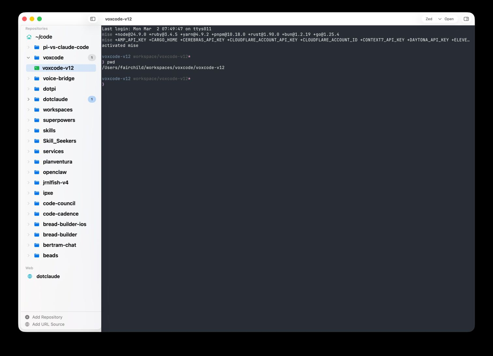
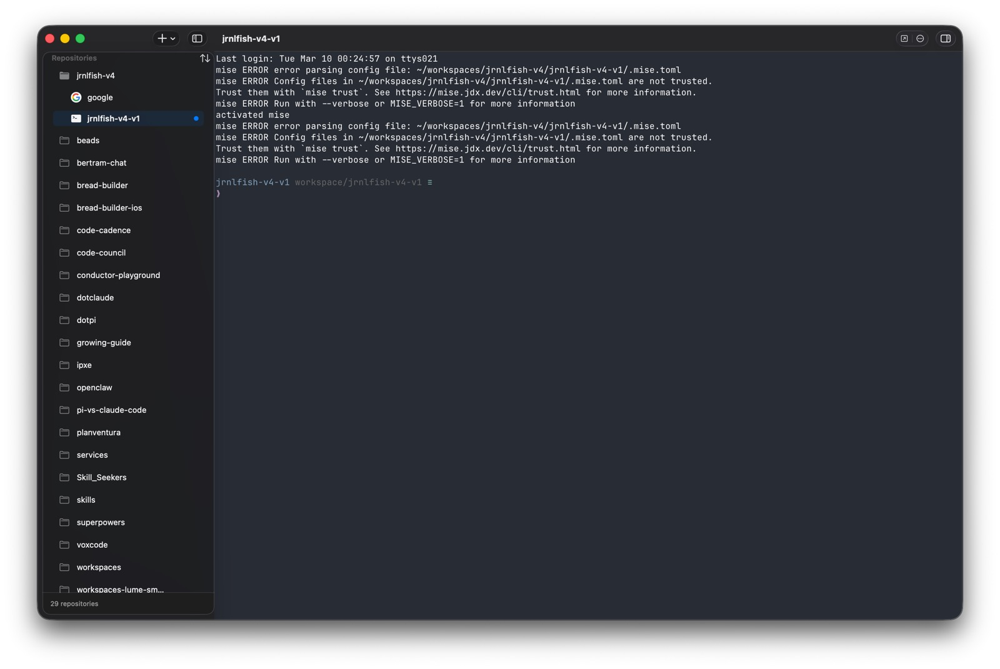

# Redesigning the Main Window, Then Shipping It

Date: 2026-03-10

Today we took Workspaces through a full loop: design review, implementation, repeated UI refinement, architecture cleanup, docs/roadmap alignment, and a production release with a small release hotfix at the end.

Before:

After:

## Session Stats

These are the best numbers I could recover from the local Codex session log and git history.

- Visible user prompts: `53`
- Visible assistant messages: `384`
- Total visible chat messages: `437`
- Session log events: `4,453`
- Visible text exchanged: `212,687` characters
- Visible-token floor: about `53,000` tokens
- Important caveat: exact model token billing was not persisted in the session log for this thread, so the real end-to-end token count was higher once tool calls, tool outputs, and hidden context are included.
- Feature-branch commits before merge: `8`
- Squash merge to `main`: `a7569b3`
- Release commit: `b8a86c6` (`release: v0.3.0`)
- Release hotfix commit: `e3ae11a`
- Main feature merge size: `46 files changed, 3,275 insertions, 1,591 deletions`
- Test suite at the end: `270 tests` across `45 suites`

## Before And After

Before:
- The app still carried a visible `Host` concept and a `Recent` section.
- The top chrome repeated context too often, especially in terminal-heavy states.
- Workspace creation was discoverable mostly through right click and scattered controls.
- Repo trees had grown busy: headers, empty states, subtitles, persistent `+` buttons, and too many visual signals competing at once.

After:
- Repo overview became the primary repo destination.
- The visible `Host` and `Recent` concepts were removed.
- Repo, workspace, and web navigation became flatter and calmer.
- Repo-owned and workspace-owned web views now live inside the same navigation model as terminals.
- Repo ordering is explicit and stable through `Alphabetical` and `Last Accessed`.
- Launch restoration became per-window and deterministic.
- Remote workspace activation no longer commits visible state before attach succeeds.

## How We Got There

At a high level, the session broke down into five steps.

1. We started with design critique, using screenshots and the real user flow instead of abstract mockups. That quickly exposed the big problems: redundant chrome, too much sidebar noise, and workspace creation paths that assumed the user already knew the trick.

2. We converted that critique into implementation. Repo overview became the launcher surface, scoped web views were added to repos and workspaces, and terminal views lost the extra top context bar so the shell could stay dominant.

3. Then we iterated on the sidebar in live captures. This mattered more than the first implementation pass. The tree only started feeling right after we removed section headers, mixed web views in flat, hid repo actions until hover, softened disclosure treatment, and aligned icons so the left edge stopped looking jagged.

4. Once the UI felt calmer, we stepped back and treated the code with the same standard. We fixed stale-selection bugs, removed the legacy repo-landing override path, extracted navigation and surface-resolution controllers, hardened remote-workspace activation, and replaced the old `Recent` section with explicit repo sorting.

5. Finally, we aligned the docs and roadmap, opened and merged the PR, shipped `v0.3.0`, noticed that the notarized DMG was incorrectly named `WorkspaceManager-0.2.0.dmg`, fixed version metadata at the source, added a release guard for tag/version mismatches, and republished the release cleanly.

## What This Session Changed

- The product is now much closer to its actual thesis: terminal first, with chrome that appears only where it helps.
- The repo tree is quieter and easier to scan.
- The app state model is more explicit and testable than it was at the start of the day.
- The release process is safer because tag/version mismatch is now a hard failure instead of a silent bad artifact name.

## Release

- PR: [#36](https://github.com/fairchild/workspaces/pull/36)
- Release: [v0.3.0](https://github.com/fairchild/workspaces/releases/tag/v0.3.0)
- Final DMG artifacts:
  - `WorkspaceManager-0.3.0.dmg`
  - `WorkspaceManager-latest.dmg`
