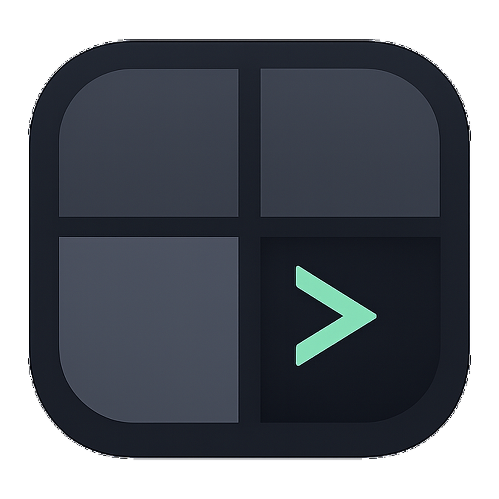
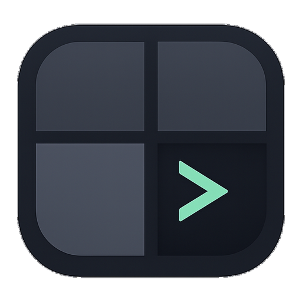
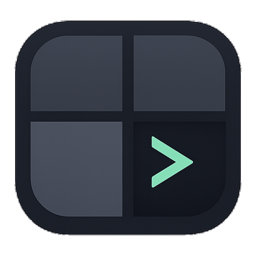
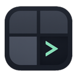

# Workspaces Branding

## App Icon

### Concept

The app icon is a dark rounded square containing a 2x2 grid. The bottom-right panel is the active terminal panel with a mint-green chevron (`>`). The other panels are muted slate tones so the active panel is the clear focal point.

This directly maps to the core user story: **a portfolio of code repositories with one active terminal session**.

### Design Principles

1. **Minimalist iconography**: Simple geometry, no gradients, no 3D effects. Flat vector style.
2. **Scales to any size**: Recognizable at 16px through 1024px, with the active chevron surviving reduction.
3. **Dark palette**: Charcoal background with a single bright accent. Matches the terminal-first developer aesthetic.
4. **Single focal element**: The green cursor is the only bright element. Everything else recedes.
5. **Metaphor-driven**: Grid = portfolio of repos. Green cell = active workspace. Terminal cursor = this is a terminal app.

### Color Palette

| Element | Color | Hex |
|---------|-------|-----|
| Outer frame | Deep charcoal-blue | `#1A1F28` (approximate) |
| Grid dividers | Slate gray | `#363C48` (approximate) |
| Inactive panels | Muted slate | `#3B414D` to `#454C5B` (approximate range) |
| Active panel | Deep navy | `#141821` (approximate) |
| Active cursor | Mint green | `#A6FFDF` (approximate) |

### Asset Files

| File | Size | Purpose |
|------|------|---------|
| [`docs/assets/icon-concepts/icon-master-1024.png`](assets/icon-concepts/icon-master-1024.png) | 1024x1024 | Master source file |
| [`docs/assets/icon-concepts/favicon-master-1024.png`](assets/icon-concepts/favicon-master-1024.png) | 1024x1024 | Favicon-specific source (active corner crop) |
| [`docs/assets/icon-concepts/favicon.ico`](assets/icon-concepts/favicon.ico) | Multi (16-256) | Web favicon |
| [`docs/assets/icon-concepts/AppIcon.icns`](assets/icon-concepts/AppIcon.icns) | Multi (16-1024) | macOS app bundle icon |
| [`Sources/WorkspaceManager/Resources/Assets.xcassets/AppIcon.appiconset/`](../Sources/WorkspaceManager/Resources/Assets.xcassets/AppIcon.appiconset/) | 10 PNGs | Xcode asset catalog (built into app) |

### Renderable Previews (GitHub)

The previews below use relative paths and should render directly on GitHub.

| Preview | File |
|---------|------|
|  | [`docs/assets/icon-concepts/icon-master-1024.png`](assets/icon-concepts/icon-master-1024.png) |
|  | [`docs/assets/icon-concepts/favicon-master-1024.png`](assets/icon-concepts/favicon-master-1024.png) |
|  | [`icon_512x512.png`](../Sources/WorkspaceManager/Resources/Assets.xcassets/AppIcon.appiconset/icon_512x512.png) |
|  | [`icon_256x256.png`](../Sources/WorkspaceManager/Resources/Assets.xcassets/AppIcon.appiconset/icon_256x256.png) |
|  | [`icon_128x128.png`](../Sources/WorkspaceManager/Resources/Assets.xcassets/AppIcon.appiconset/icon_128x128.png) |

Small-size source files (upscaled for visibility):


### macOS Asset Catalog Sizes

| Filename | Pixels | Scale | Slot |
|----------|--------|-------|------|
| `icon_16x16.png` | 16x16 | 1x | Menu bar, Finder list |
| `icon_16x16@2x.png` | 32x32 | 2x | Menu bar, Finder list (Retina) |
| `icon_32x32.png` | 32x32 | 1x | Finder, Dock (small) |
| `icon_32x32@2x.png` | 64x64 | 2x | Finder, Dock (Retina) |
| `icon_128x128.png` | 128x128 | 1x | Finder preview |
| `icon_128x128@2x.png` | 256x256 | 2x | Finder preview (Retina) |
| `icon_256x256.png` | 256x256 | 1x | Finder |
| `icon_256x256@2x.png` | 512x512 | 2x | Finder (Retina) |
| `icon_512x512.png` | 512x512 | 1x | App Store |
| `icon_512x512@2x.png` | 1024x1024 | 2x | App Store (Retina) |

### Regenerating App Icon Set

From the app-icon master 1024px PNG:

```bash
# Resize all asset catalog PNGs
SRC="docs/assets/icon-concepts/icon-master-1024.png"
DEST="Sources/WorkspaceManager/Resources/Assets.xcassets/AppIcon.appiconset"
sips -s format png -z 16 16 "$SRC" --out "$DEST/icon_16x16.png"
sips -s format png -z 32 32 "$SRC" --out "$DEST/icon_16x16@2x.png"
sips -s format png -z 32 32 "$SRC" --out "$DEST/icon_32x32.png"
sips -s format png -z 64 64 "$SRC" --out "$DEST/icon_32x32@2x.png"
sips -s format png -z 128 128 "$SRC" --out "$DEST/icon_128x128.png"
sips -s format png -z 256 256 "$SRC" --out "$DEST/icon_128x128@2x.png"
sips -s format png -z 256 256 "$SRC" --out "$DEST/icon_256x256.png"
sips -s format png -z 512 512 "$SRC" --out "$DEST/icon_256x256@2x.png"
sips -s format png -z 512 512 "$SRC" --out "$DEST/icon_512x512.png"
sips -s format png -z 1024 1024 "$SRC" --out "$DEST/icon_512x512@2x.png"

# Create .icns (macOS native)
mkdir -p /tmp/AppIcon.iconset
# ... (see sips commands for each size)
iconutil -c icns /tmp/AppIcon.iconset -o docs/assets/icon-concepts/AppIcon.icns
```

### Regenerating Favicon

The favicon intentionally uses a focused crop of the active bottom-right terminal panel for small-size legibility.

```bash
SRC="docs/assets/icon-concepts/favicon-master-1024.png"
magick "$SRC" \
  \( -clone 0 -resize 16x16 \) \
  \( -clone 0 -resize 32x32 \) \
  \( -clone 0 -resize 48x48 \) \
  \( -clone 0 -resize 64x64 \) \
  \( -clone 0 -resize 128x128 \) \
  \( -clone 0 -resize 256x256 \) \
  -delete 0 docs/assets/icon-concepts/favicon.ico
```

## Exploration Process

Initial concept exploration happened on 2026-02-15 and selected the portfolio-grid direction.

On 2026-02-16, the production icon was refined for:
1. Higher mark occupancy in the app icon frame.
2. Better small-size contrast.
3. A favicon-specific crop focused on the active terminal corner.

All working artifacts are preserved in `docs/assets/icon-concepts/`.

### Generation Details

**Model**: OpenAI `gpt-image-1.5` (primary adopted variant) with follow-up comparison runs in Google Gemini and Google Imagen.

**Prompt focus** (adopted variant):

> macOS app icon for a developer workspace manager. Keep a 2x2 grid metaphor with the bottom-right panel active as terminal. Increase contrast and occupancy for small-size readability. Use one mint-green chevron as the only bright accent. No text, no logos, no photorealism.

**Iteration notes**: The prompt evolved through 7 rounds. Key learnings:
- Explicitly requesting "SOLID BLACK background" was necessary — the API defaults to light backgrounds
- Referencing specific hex colors helped but wasn't always followed
- Describing the metaphor ("portfolio of repositories where one is active") produced better composition than purely visual descriptions
- Asking for "no text, no letters" was essential to prevent the model from adding labels

## Usage Guidelines

- Always use the provided assets; do not recreate icon variants ad hoc in product docs
- The icon works on both light and dark macOS backgrounds (the dark rounded rect provides its own container)
- For web/GitHub tabs, use `favicon.ico` generated from `favicon-master-1024.png`
- For README badges or documentation, use `icon_256x256.png`
- The master file for any future re-generation is `docs/assets/icon-concepts/icon-master-1024.png`
