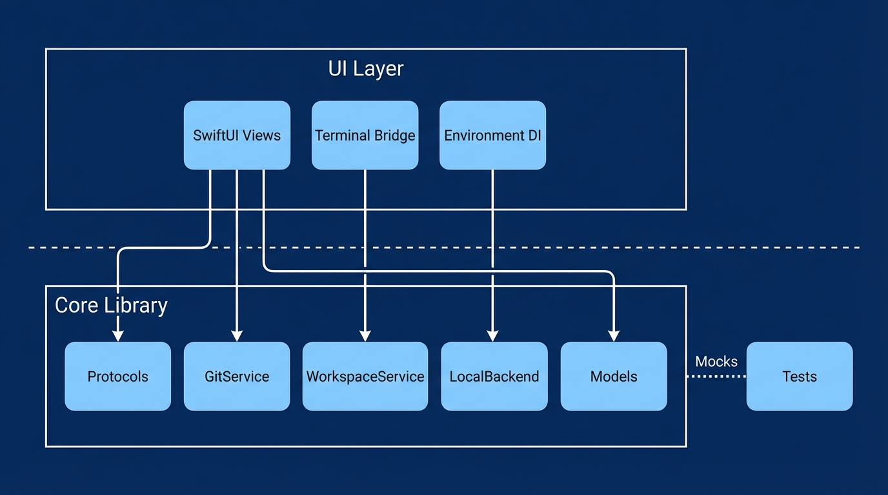
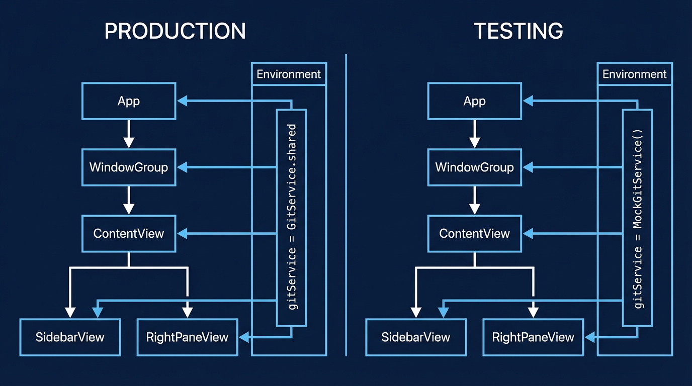
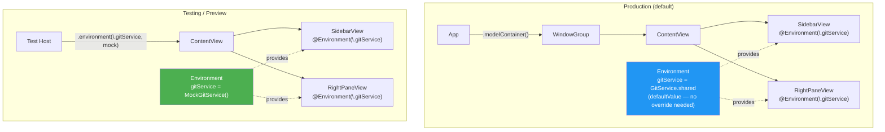
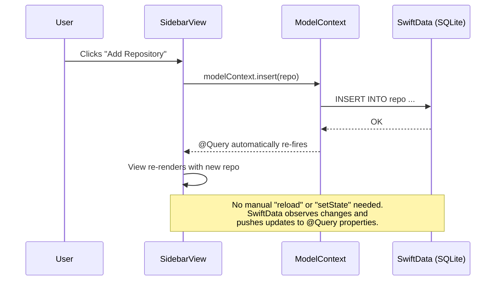
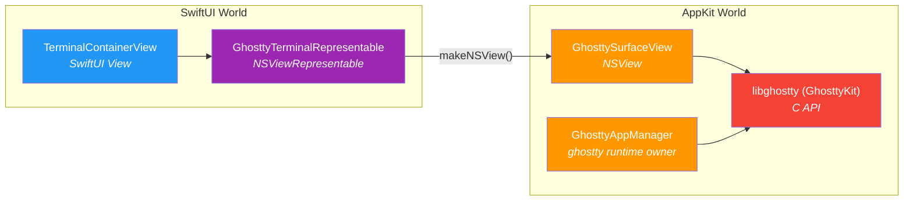

# Swift & macOS Patterns for Web Developers

A guide to the patterns and principles in this codebase, explained through the lens
of TypeScript, Python, and Rails.

---

## The Big Mental Shift

In web development, your app is a process that handles requests. In macOS development,
your app is an **event loop that reacts to user interaction**. SwiftUI makes this feel
declarative (like React), but underneath it's an AppKit application with windows,
responders, and a run loop.

| Web Concept                   | macOS Equivalent                            |
|-------------------------------|---------------------------------------------|
| React component               | SwiftUI `View` (struct, not class)          |
| Express/FastAPI route handler | Button action or `.task {}` modifier        |
| Redux store                   | `@State`, `@Observable`, or SwiftData       |
| SQLite/Postgres               | SwiftData (ORM built into the OS)           |
| npm package                   | Swift Package Manager (SPM) dependency      |
| `node_modules/`               | `.build/` directory                         |
| Docker container              | macOS process (or Virtualization framework) |

### Architecture at a Glance



The app has two SPM targets. The bottom layer (`WorkspaceManagerCore`) contains
all logic and data — no UI imports. The top layer (`WorkspaceManager`) is the
executable that adds SwiftUI views and the AppKit terminal bridge. Tests only
need the Core target.

```mermaid
graph TB
    subgraph "WorkspaceManager (Executable)"
        App[WorkspaceManagerApp]
        CV[ContentView]
        SV[SidebarView]
        RPV[RightPaneView]
        TV[TerminalView]
        App --> CV
        CV --> SV
        CV --> TV
        CV --> RPV
    end

    subgraph "WorkspaceManagerCore (Library)"
        P[Protocols]
        GS[GitService actor]
        WS[WorkspaceService actor]
        LB[LocalBackend actor]
        M[Models - SwiftData]
        P -.defines.-> GS
        P -.defines.-> WS
        WS -->|uses| GS
    end

    SV -->|@Environment| GS
    SV -->|@Environment| WS
    RPV -->|@Environment| GS
    CV -->|@Query| M

    subgraph "Tests"
        MGS[MockGitService]
        TGR[TestGitRepository]
        MGS -.conforms to.-> P
    end

    style App fill:#2196F3,color:#fff
    style P fill:#FF9800,color:#fff
    style MGS fill:#4CAF50,color:#fff
```

---

## 1. Value Types Over Reference Types

Swift structs are the default. Classes exist but you reach for them deliberately.

```swift
// Swift struct — copied on assignment, no shared mutation bugs
struct FileChange: Sendable {
    let path: String
    let status: GitStatus
}
```

**Web analogy:** Imagine if every JavaScript object was frozen by default. No
`Object.freeze()` needed — mutation requires opting in. This eliminates an entire
category of bugs where two parts of your code hold references to the same object
and one mutates it unexpectedly.

SwiftUI views are structs. They're cheap value descriptions of UI, not the UI
itself. SwiftUI diffs them (like React's virtual DOM) and updates the real UI.

```swift
struct RepoRow: View {          // struct, not class
    let repo: Repo              // just data

    var body: some View {       // computed property — returns a description
        Label(repo.name, systemImage: "folder.fill")
    }
}
```

---

## 2. Actors for Thread Safety

Swift actors are the concurrency primitive. An actor serializes access to its
mutable state — only one caller can execute inside it at a time.

```swift
public actor GitService: GitServiceProtocol {
    public static let shared = GitService()
    // All methods are implicitly async when called from outside
}
```

**Web analogy:** Think of an actor like a FastAPI endpoint with a database
connection pool of size 1. Every request goes through a queue. You can't have
two requests reading and writing at the same time. The compiler enforces this.

In TypeScript/Python, you prevent race conditions with locks, mutexes, or just
hoping. In Swift, the **type system** prevents them. If you try to access an
actor's state from outside without `await`, the compiler refuses to build.

```
 Caller A ──► ┐
              │   ┌─────────────────────────┐
 Caller B ──► ├──►│  GitService (actor)     │
              │   │                         │
 Caller C ──► ┘   │  Only ONE caller runs   │
                  │  at a time. Others wait.│
   queue ════►    └─────────────────────────┘

 vs. a regular class:

 Caller A ──►┐    ┌─────────────────────────┐
              ├──►│  SomeClass              │
 Caller B ──►┘    │                         │
                  │  Both run at once.      │
                  │  Data race! 💥          │
                  └─────────────────────────┘
```

---

## 3. Protocols = Interfaces (but better)

Swift protocols are like TypeScript interfaces, but they're used for more:

```swift
public protocol GitServiceProtocol: Sendable {
    func getStatus(at path: URL) async throws -> [FileChange]
    func createBranch(_ name: String, at path: URL) async throws
    // ...
}
```

**TypeScript equivalent:**
```typescript
interface GitService {
    getStatus(path: string): Promise<FileChange[]>
    createBranch(name: string, path: string): Promise<void>
}
```

The `: Sendable` constraint means "this type is safe to pass between threads."
The compiler checks this. There's no runtime equivalent in web languages because
JavaScript is single-threaded and Python has the GIL.

We mark protocols `Sendable` (not `Actor`-constrained) so that mocks can be
plain classes. If we used `actor` in the protocol, every mock would need to be
an actor too, which adds unnecessary complexity to tests.

---

## 4. Dependency Injection via Environment

SwiftUI has a built-in DI container called Environment. It flows values down
the view tree, similar to React Context.

```swift
// 1. Define the key with a default value
private struct GitServiceKey: EnvironmentKey {
    static let defaultValue: any GitServiceProtocol = GitService.shared
}

// 2. Add a nice accessor
extension EnvironmentValues {
    var gitService: any GitServiceProtocol {
        get { self[GitServiceKey.self] }
        set { self[GitServiceKey.self] = newValue }
    }
}

// 3. Use it in views
struct SidebarView: View {
    @Environment(\.gitService) private var gitService
}
```

**React equivalent:**
```tsx
const GitServiceContext = createContext<GitService>(realGitService)

function SidebarView() {
    const gitService = useContext(GitServiceContext)
}

// In tests:
<GitServiceContext.Provider value={mockGitService}>
    <SidebarView />
</GitServiceContext.Provider>
```

**Rails equivalent:** It's like `config.active_job.queue_adapter` — a setting
that defaults to production behavior but can be overridden in tests
(`config.active_job.queue_adapter = :test`). Except the override is scoped to
a branch of the view tree, not globally.

**Why not just use `.shared` singletons?** Same reason you don't hardcode
`fetch("https://api.production.com")` in React components. You want to swap
the implementation in tests, previews, and potentially different parts of the UI.

### How Environment Values Flow





Values flow **down** the tree. A child view reads what its ancestors provided.
If no ancestor set a value, the `defaultValue` from the key definition is used.

---

## 5. SwiftData = ActiveRecord (kinda)

SwiftData is Apple's ORM. You define models with the `@Model` macro and the
framework handles persistence, migrations, and queries.

```swift
@Model
public final class Repo {
    public var name: String
    public var localPath: String
    @Relationship(deleteRule: .cascade, inverse: \Workspace.sourceRepo)
    public var workspaces: [Workspace] = []
}
```

**Rails equivalent:**
```ruby
class Repo < ApplicationRecord
    has_many :workspaces, dependent: :destroy
end
```

**Key difference:** SwiftData models are observed by SwiftUI. When a property
changes, views that read it automatically re-render. There's no manual
`setState` or `notifyListeners`. It's like having ActiveRecord + Turbo Streams
built into the language.

The `ModelContainer` is your database connection. The `ModelContext` is your
unit of work (like a database transaction or Rails' `ActiveRecord::Base.transaction`).

```swift
@main
struct WorkspaceManagerApp: App {
    var body: some Scene {
        WindowGroup {
            ContentView()
        }
        .modelContainer(for: [Repo.self, Workspace.self])  // "database connection"
    }
}
```



In web terms: it's as if your SQL query was a live subscription. Insert a row,
and every component using that query re-renders automatically.

---

## 6. Error Handling = Explicit, Checked

Swift uses typed errors. Every function that can fail is marked `throws`, and
you must handle the error at the call site. No uncaught exceptions crashing
your app at 3am.

```swift
public enum WorkspaceError: LocalizedError {
    case alreadyExists(name: String)
    case copyFailed(reason: String)

    public var errorDescription: String? {
        switch self {
        case .alreadyExists(let name): return "Workspace '\(name)' already exists"
        case .copyFailed(let reason): return "Copy failed: \(reason)"
        }
    }
}
```

**TypeScript equivalent:** Imagine if every `async` function that could throw
was marked in its signature, and the compiler refused to compile if you didn't
`try/catch` it. That's Swift.

**Python equivalent:** Like FastAPI's `HTTPException`, but for everything, and
the compiler enforces handling.

The `LocalizedError` protocol provides `errorDescription` for user-facing
messages. It's like Rails' `I18n.t` for error strings, but tied to the error
type itself.

---

## 7. Property Wrappers = Decorators with Teeth

Swift property wrappers transform how a property is stored and accessed.
SwiftUI uses them heavily.

```swift
@State private var isLoading = false          // Local component state
@Binding var selectedWorkspace: Workspace?    // Two-way binding from parent
@Environment(\.gitService) var gitService     // Read from DI container
@Query var repos: [Repo]                      // Live database query
```

**React equivalent:**
```tsx
const [isLoading, setIsLoading] = useState(false)    // @State
// props.selectedWorkspace (with onChange)             // @Binding
const gitService = useContext(GitServiceContext)       // @Environment
const repos = useLiveQuery(() => db.repos.toArray())  // @Query
```

**Python equivalent:** Like `Depends()` in FastAPI, but resolved by the
framework automatically:

```python
@app.get("/repos")
async def get_repos(db: Session = Depends(get_db)):  # @Environment
    ...
```

The `@` syntax looks like Python decorators, but property wrappers are
type-safe and resolved at compile time.

---

## 8. Testing with Swift Testing

We use Apple's Swift Testing framework (not XCTest). It's modern, expressive,
and supports async natively.

```swift
@Suite("WorkspaceService", .serialized)
struct WorkspaceServiceTests {

    @Test("createWorkspace calls git createBranch with correct name")
    func createWorkspaceCallsCreateBranch() async throws {
        let mockGit = MockGitService()
        let service = WorkspaceService(gitService: mockGit)

        _ = try await service.createWorkspace(from: repo, name: "my-feature")

        #expect(mockGit.createBranchCalls.count == 1)
        #expect(mockGit.createBranchCalls[0].name == "workspace/my-feature")
    }
}
```

**Jest equivalent:**
```typescript
describe("WorkspaceService", () => {
    test("createWorkspace calls git createBranch with correct name", async () => {
        const mockGit = new MockGitService()
        const service = new WorkspaceService(mockGit)

        await service.createWorkspace(repo, "my-feature")

        expect(mockGit.createBranchCalls).toHaveLength(1)
        expect(mockGit.createBranchCalls[0].name).toBe("workspace/my-feature")
    })
})
```

**Key patterns:**
- `@Suite` = `describe` block. `.serialized` means tests run one at a time
  (needed when tests touch shared state like UserDefaults or the filesystem)
- `@Test("description")` = `test("description", ...)`
- `#expect(condition)` = `expect(condition).toBe(true)`
- `#expect(throws: ErrorType.self)` = `expect(...).toThrow(ErrorType)`

Mocks are plain classes conforming to protocols. No mocking library needed.
The mock tracks calls in arrays and returns configurable values:

```swift
final class MockGitService: GitServiceProtocol, @unchecked Sendable {
    var createBranchCalls: [(name: String, path: URL)] = []
    var createBranchError: Error? = nil

    func createBranch(_ name: String, at path: URL) async throws {
        createBranchCalls.append((name: name, path: path))
        if let error = createBranchError { throw error }
    }
}
```

The `@unchecked Sendable` tells the compiler "trust me, this is thread-safe"
— acceptable for tests that run serially, dangerous in production code.

---

## 9. File Organization

Each file does one thing. We split by **responsibility**, not by "model/view/
controller":

```
Sources/
  WorkspaceManagerCore/          # Library target (no UI)
    Models/Models.swift          # Data structures
    Services/
      Protocols.swift            # Service interfaces
      GitService.swift           # Git operations (actor)
      WorkspaceService.swift     # Workspace lifecycle (actor)
      LocalBackend.swift         # Process execution (actor)
      LocalTerminal.swift        # PTY management
      Errors.swift               # Error types
      ProcessResult.swift        # Shared result struct

  WorkspaceManager/              # Executable target (UI)
    App/WorkspaceManagerApp.swift
    Views/
      MainWindow/
        ContentView.swift        # Top-level layout
        SidebarView.swift        # Left sidebar logic
        SidebarRows.swift        # Row components (pure display)
        NewWorkspaceSheet.swift  # Modal sheet
        RightPaneView.swift      # File tree + changes
      Components/
        TerminalView.swift       # SwiftUI bridge for terminal container
      Terminal/
        GhosttyAppManager.swift  # ghostty_app lifecycle + callbacks
        GhosttySurfaceView.swift # NSView terminal surface + input
        GhosttyInput.swift       # NSEvent -> ghostty input mapping
        GhosttyTerminalConfig.swift # Surface config/env assembly
```

**Why two targets?** `WorkspaceManagerCore` has no UI imports. It can be tested
without launching an app, just like testing a Rails model without booting the
server. The `WorkspaceManager` target imports Core and adds the UI layer.

**Rails equivalent:**
```
app/models/       → Models/
app/services/     → Services/
app/views/        → Views/
app/controllers/  → (SwiftUI handles routing internally)
```

---

## 10. AppKit + SwiftUI = The Escape Hatch

SwiftUI is declarative and covers ~90% of UI needs. For the remaining 10%
(embedded terminal, low-level keyboard handling), we drop to AppKit — Apple's
older, imperative UI framework.

```swift
struct GhosttyTerminalRepresentable: NSViewRepresentable {
    func makeNSView(context: Context) -> GhosttySurfaceView {
        GhosttySurfaceView(workingDirectory: workingDirectory)
    }
    func updateNSView(_ view: GhosttySurfaceView, context: Context) {}
}
```

**React equivalent:** Like using `useRef` + `useEffect` to integrate a
vanilla JS library (CodeMirror, xterm.js). The bridge protocol
(`NSViewRepresentable`) is similar to writing a React wrapper
around an imperative DOM API.

We keep AppKit code isolated in dedicated files under `Sources/WorkspaceManager/Terminal/`
so the rest of the app stays purely SwiftUI.



The purple box is the **bridge** — it speaks both SwiftUI and AppKit. Everything
to its left is declarative. Everything to its right is imperative. The bridge
translates between them.

---

## Quick Reference: Swift ↔ Web Concepts

| Swift | TypeScript | Python | Rails |
|-------|-----------|--------|-------|
| `struct` | frozen object | `@dataclass(frozen=True)` | `Struct.new` |
| `class` | object | class | class |
| `actor` | worker thread + message queue | `asyncio.Lock` per method | Sidekiq worker |
| `protocol` | `interface` | `Protocol` / ABC | duck typing |
| `enum` with associated values | discriminated union | `@dataclass` per variant | — |
| `@State` | `useState` | — | — |
| `@Environment` | `useContext` | `Depends()` | `config.x.setting` |
| `@Model` (SwiftData) | Prisma model | SQLAlchemy model | ActiveRecord |
| `@Query` | `useLiveQuery` | — | `scope` |
| `async throws` | `async` + thrown Error | `async def` + raised Exception | — |
| `#expect()` | `expect()` | `assert` | `assert_equal` |
| `@Suite` | `describe` | `class TestX` | `class TestX < Minitest` |
| `@Test` | `test` / `it` | `def test_x` | `def test_x` |
