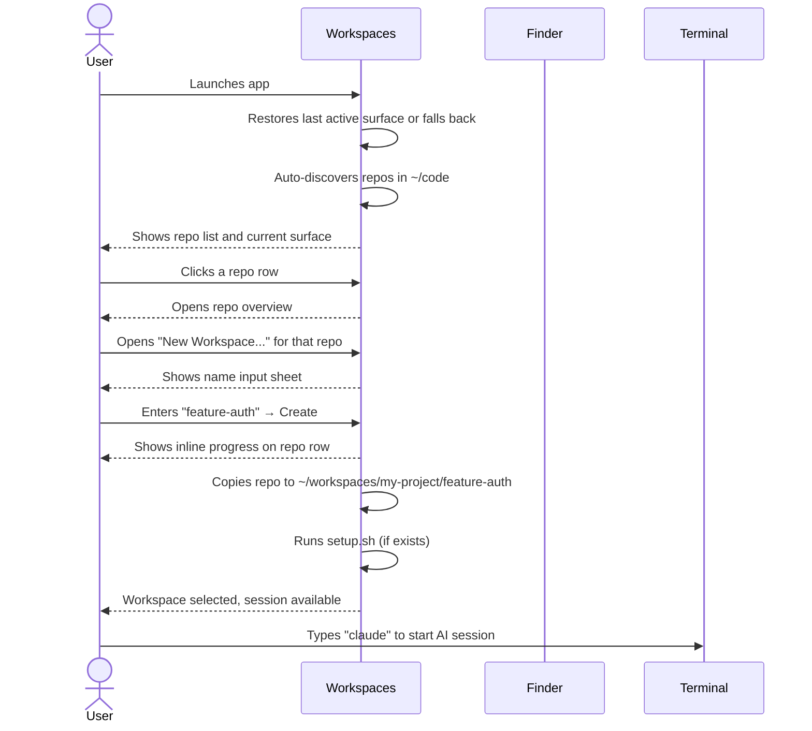
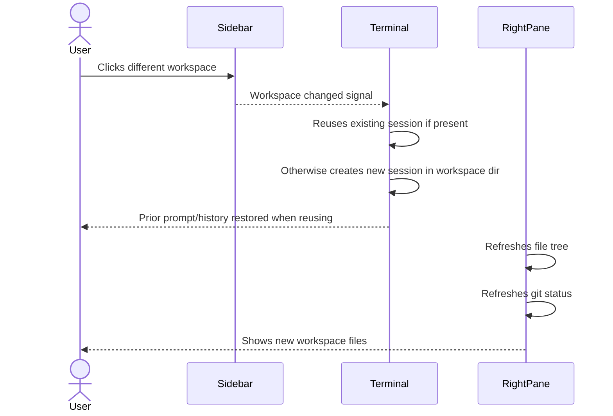
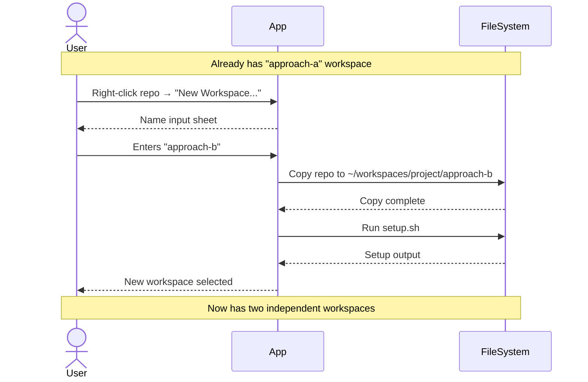
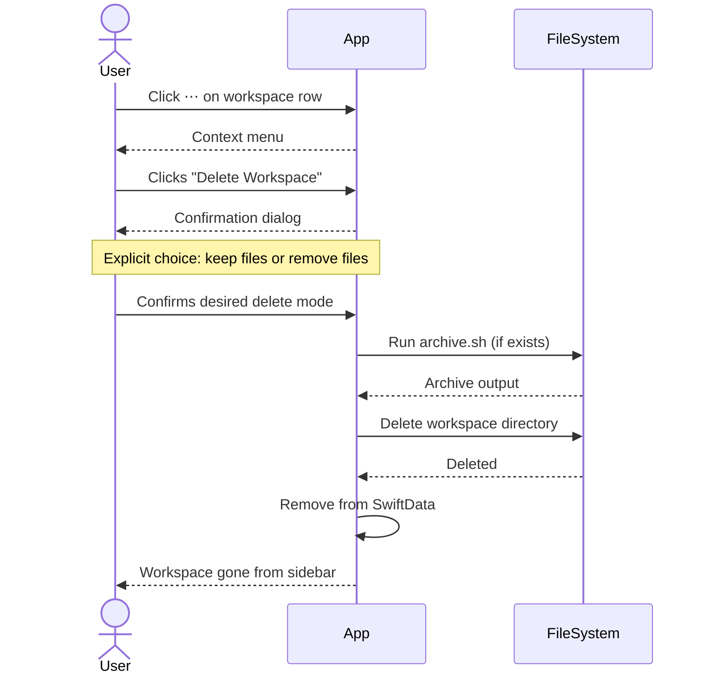
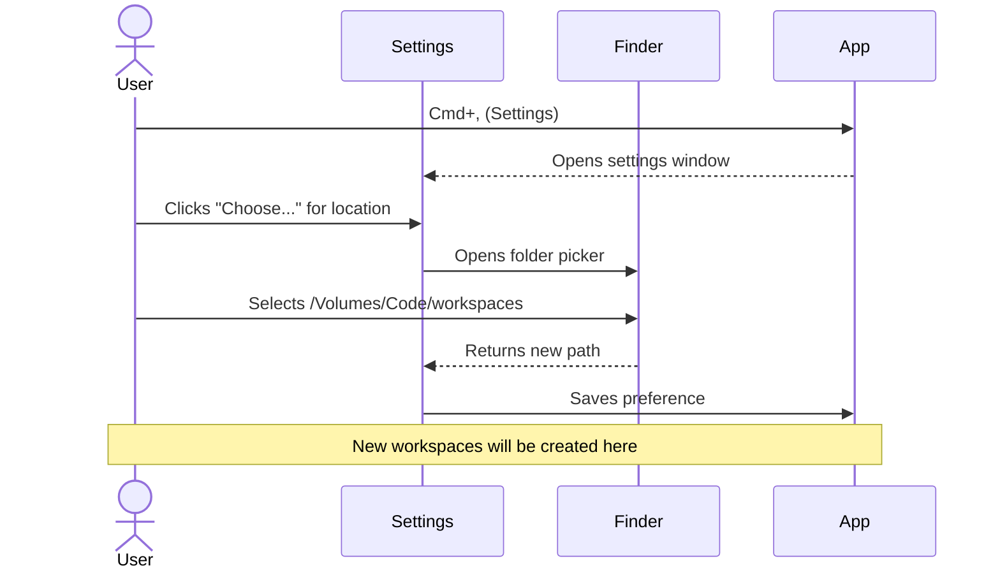
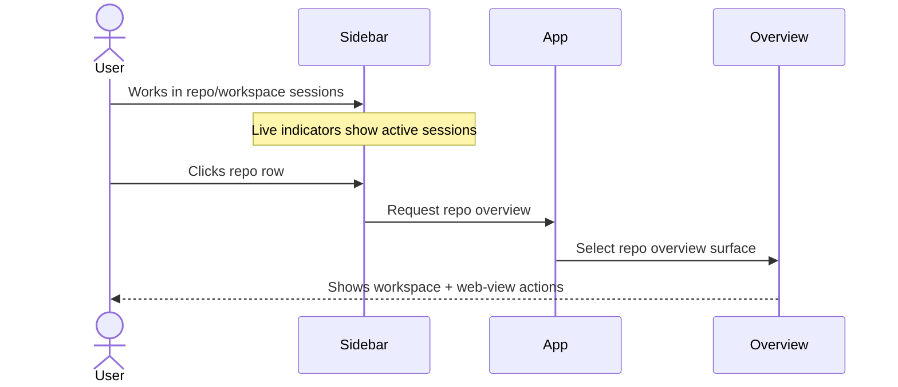
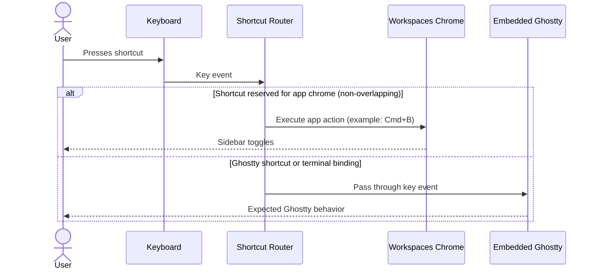

# Workspaces User Stories

## Product Context

Workspaces is a Mac app for managing isolated AI coding sessions. Users add git repos, fork them into workspaces, and run terminal-based coding agents (Claude Code, Aider, Codex CLI, or any shell command) in an embedded terminal. Each workspace is a clean copy with automatic setup.

### Current Behavior Snapshot (2026-03-10)

- App launch restores the last active repo overview, workspace terminal, or web view. If no saved surface is valid, it falls back to the most recent workspace, then web view, then first repo overview.
- Repositories are auto-discovered from `~/code` (non-recursive) on first load, and can still be managed manually.
- Sidebar repo clicks open repo overviews. Workspace clicks open or resume persistent terminal sessions for those directories.
- Repo-owned web views and workspaces are nested under expandable repo rows.
- Sidebar shows live-session state so users can see which repos already have an active terminal.
- Sidebar sorting is explicit: `Alphabetical` by default, with a stable `Last Accessed` option.
- Workspace creation shows immediate inline progress on the source repo row while copy/setup work runs.
- Shortcut policy direction: Ghostty bindings should flow through by default; app-specific shortcuts should be limited to wrapper chrome.
- Ghostty split actions currently support create, focus, resize, and equalize within the app's two-pane split model.

---

## Story 1: First-Time Setup (Repo-First)

**As a** developer new to Workspaces
**I want to** add my first repository and create a workspace
**So that** I can start an isolated AI coding session

### Flow Diagram



### ASCII Wireframe

```
┌──────────────────────────────────────────────────────────────────────────┐
│  Workspaces                                              [−] [□] [×]     │
├────────────────┬─────────────────────────────────────────┬───────────────┤
│                │                                         │ [Files][∆ 3]  │
│ M my-api    ⋯ +│  $ claude                               │───────────────│
│   ↳ feature-auth│  > Analyzing codebase...               │ 📁 src/       │
│     main · 2m  │  > Found 47 files                       │   📄 index.ts │
│                │  > What would you like to do?           │   📄 app.ts   │
│ F frontend  ⋯ +│                                         │ 📁 tests/     │
│                │  _                                      │ 📄 README.md  │
│ S services  ⋯ +│                                         │               │
│   ↳ bugfix-nav │                                         │ Updated 2s ago│
│     main · 39m │                                         │     [↻]       │
│                │                                         │               │
├────────────────┤─────────────────────────────────────────┴───────────────┤
│ [+] Add repo   │                                                         │
└────────────────┴─────────────────────────────────────────────────────────┘
```

**Sidebar structure:**
- Repositories section shows repo rows only.
- Repo-owned web views and workspaces appear under their source repo when that repo is expanded.
- Repo rows can show a live terminal indicator and active-session highlight.
- Selected workspace controls right-pane file/changes context.
- Repository sorting is available from the `Repositories` header.

### Steps

1. **Launch app** — App restores the last active surface or falls back to a repo overview.
2. **Repos hydrate** — App auto-loads top-level git repos from `~/code`.
3. **Select repo** — Clicking repo opens its overview.
4. **Create workspace** — User runs "New Workspace..." and enters a name.
5. **Progress shown** — Repo row stays expanded and displays coarse creation progress while copy/setup runs.
6. **Workspace initialized** — Repo copy is created, setup hook runs, workspace appears in sidebar and opens in the terminal.

---

## Story 2: Switching Between Workspaces

**As a** developer with multiple active workspaces
**I want to** quickly switch between them
**So that** I can context-switch without losing my place

### Flow Diagram



### ASCII Wireframe

```
┌──────────────────┐         ┌──────────────────┐
│ M my-api      ⋯ +│         │ M my-api      ⋯ +│
│   ↳ feature-auth │ ──────▶ │   ↳ feature-auth │
│     main · 2m ◀──│  click  │     main · 2m    │
│   ↳ bugfix-nav   │         │   ↳ bugfix-nav ◀─│
│     main · 39m   │         │     main · now   │
└──────────────────┘         └──────────────────┘
        │                            │
        ▼                            ▼
┌─────────────────┐          ┌─────────────────┐
│ ~/ws/auth/ $    │          │ ~/ws/bugfix/ $  │
│ claude          │          │ _               │
│ > Working on... │          │                 │
└─────────────────┘          └─────────────────┘
```

### Steps

1. **View workspaces** — Sidebar shows all workspaces, current one highlighted
2. **Click different workspace** — User clicks another workspace name
3. **Terminal switches** — Existing session is restored when available; otherwise a new one is created
4. **Right pane updates** — File tree and git status refresh for new workspace

---

## Story 3: Creating Parallel Experiments

**As a** developer exploring different solutions
**I want to** create multiple workspaces from the same repo
**So that** I can experiment without affecting other work

### Flow Diagram



### ASCII Wireframe

```
┌──────────────────┐
│ M my-api      ⋯ +│ ◄── Click + to add workspace
│   ↳ approach-a   │
│     main · 1h    │     ┌───────────────────┐
│   ↳ approach-b ◀─│     │ New Workspace...  │
│     main · now   │     │ Reveal in Finder  │
│                  │     │ Remove Repo       │
│ F frontend    ⋯ +│     └───────────────────┘
│                  │     (⋯ menu shown)
└──────────────────┘

~/workspaces/my-api/
├── approach-a/     ← Independent copy
│   ├── .git/
│   └── src/
└── approach-b/     ← Independent copy
    ├── .git/
    └── src/
```

### Steps

1. **Right-click repo** — Context menu appears with "New Workspace..." option
2. **Name workspace** — User enters descriptive name like "approach-b"
3. **Copy created** — Full repo copy made to workspaces directory
4. **Setup runs** — If setup.sh exists, it runs automatically
5. **Workspace ready** — New workspace selected, terminal opens there

---

## Story 4: Cleaning Up Completed Work

**As a** developer who finished a task
**I want to** archive or delete a workspace
**So that** I can keep my workspace list clean

### Flow Diagram



### ASCII Wireframe

```
┌────────────────────────────────────────┐
│       Delete "feature-auth"?           │
├────────────────────────────────────────┤
│                                        │
│  This will remove the workspace from   │
│  the list.                             │
│                                        │
│  ☑ Also delete files from disk         │
│                                        │
│          [Cancel]    [Delete]          │
└────────────────────────────────────────┘
```

### Steps

1. **Right-click workspace** — Context menu shows Archive and Delete options
2. **Click Delete** — Confirmation dialog appears
3. **Choose file handling** — User picks "Delete (Keep Files)" or "Delete and Remove Files"
4. **archive.sh runs** — If present, cleanup script runs first
5. **Workspace removed** — Deleted from list (and optionally from disk)

---

## Story 5: Configuring Workspace Location

**As a** developer with specific disk organization preferences
**I want to** choose where workspaces are stored
**So that** they're on my preferred drive or folder

### Flow Diagram



### ASCII Wireframe

```
┌─────────────────────────────────────────────────────┐
│  Settings                                    [×]    │
├─────────────────────────────────────────────────────┤
│                                                     │
│  Workspaces Location                                │
│  ┌───────────────────────────────────────┐          │
│  │ /Volumes/Code/workspaces          [📁]│          │
│  └───────────────────────────────────────┘          │
│  Where new workspaces are created.                  │
│                                                     │
│  [Reset to Default]                                 │
│                                                     │
│  ─────────────────────────────────────────────────  │
│                                                     │
│  Terminal                                           │
│  Font Size: [13]                                    │
│                                                     │
└─────────────────────────────────────────────────────┘
```

### Steps

1. **Open settings** — User presses Cmd+, or uses menu
2. **View current location** — Shows current workspaces root path
3. **Click Choose** — Folder picker opens
4. **Select new location** — User picks preferred directory
5. **Setting saved** — All new workspaces will be created in new location

---

## Story 6: Returning to Repo Overview Context

**As a** developer switching between many repos and workspaces
**I want to** get back to a repo's overview in one click
**So that** I can launch another workspace or web view without losing context

### Flow Diagram



### ASCII Wireframe

```
┌─────────────────────┐
│ [repo] my-api LIVE  │ ← Live indicator (has active session)
│   🌐 docs           │
│   > feature-auth    │
│ [repo] frontend  ◀──│ ← User clicks repo row to return
│ [repo] services LIVE│
└─────────────────────┘
        │
        ▼  (after clicking repo row)
┌─────────────────────────────────────────┐
│ frontend                                │
│ ~/code/frontend                         │
│                                         │
│  Workspaces                             │
│   • sidebar-cleanup                     │
│   • release-prep                        │
│                                         │
│  Web Views                              │
│   • docs                                │
└─────────────────────────────────────────┘
```

### Steps

1. **Work in repo/workspace sessions** — User clicks around and accumulates live sessions.
2. **Review session indicators** — Sidebar shows which repos already have active terminals.
3. **Click repo row** — Main content switches from the workspace terminal back to that repo's overview.
4. **Launch next action** — User creates a workspace or opens a repo-owned web view from the overview.

---

## Story 7: Ghostty Shortcut Parity With App Chrome Routing

**As a** terminal-first developer already fluent in Ghostty
**I want to** keep expected Ghostty keybindings inside embedded terminals
**So that** Workspaces feels like Ghostty with management chrome, not a different terminal

### Flow Diagram



### ASCII Wireframe

```
┌───────────────────────────────────────────────────────┐
│ Wrapper Chrome                                        │
│  Cmd+B → Toggle Sidebar (app-owned)                   │
├───────────────────────────────────────────────────────┤
│ Embedded Ghostty Surface                              │
│  Cmd+D / split bindings / navigation / copy modes     │
│  should behave the same as Ghostty users expect       │
│                                                       │
│  $ _                                                  │
└───────────────────────────────────────────────────────┘
```

### Steps

1. **User presses a shortcut** — input is evaluated by routing policy.
2. **Non-overlapping app shortcut** — app chrome action executes (for example, `Cmd+B`).
3. **Terminal shortcut** — event passes to Ghostty without app reinterpretation.
4. **Result matches expectation** — Ghostty users get familiar behavior in embedded terminal.

### Acceptance Criteria

1. Workspaces defines and documents a default-first routing policy: Ghostty gets terminal shortcuts by default.
2. App-level shortcuts are explicitly scoped to wrapper chrome behaviors only.
3. Shortcut collisions are treated as policy decisions, not hardcoded one-off exceptions.
4. Product backlog includes user-configurable routing overrides (`App` vs `Ghostty`) for conflicting shortcuts.
5. Terminal shortcut handling avoids single-shortcut special cases (for example explicit `Cmd+D` intercepts) in favor of binding-based routing.
