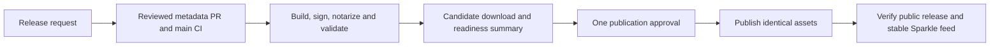

# Releasing WorkspaceManager

A release request prepares a signed, notarized installer and its Sparkle feed,
then waits for one human publication approval. Optional manual testing uses the
same installer that will ship.

## Normal release

```bash
uv run --script scripts/release.py --dry-run
uv run --script scripts/release.py --version <X.Y.Z> --notes-file /path/to/notes.md
```

Omit `--version` to select the conventional-commit version. The agent reviews the
release notes and their Sparkle rendering, runs the entry point, completes the
metadata PR's required review, and follows CI until the candidate is ready.
A request to cut a release authorizes this preparation and metadata auto-merge;
it does not authorize an agent to approve publication. Do not add routine chat
confirmations or push a stable tag manually. Generic release skills use this
repo entry point and contract.



At readiness, download the candidate from the workflow summary if you want to
test it, or choose **Review deployments → release-publication → Approve and
deploy**. The artifact link is also the deployment's environment URL. No manual
test confirmation is needed. Signing and validation failures appear before
this button becomes available.

The automation checks exact-source main CI, bundle signing and provisioning,
notarization, Gatekeeper, artifact hashes, the Sparkle signature, and packaged
CLI launch. It reads committed performance evidence under the existing
freshness policy. It does not claim a full GUI or installed Sparkle upgrade test.
Laptop performance measurements still require their separate owner opt-in.

## Prerequisites

### Apple Developer Program

You need an Apple Developer Program membership ($99/year) for:
- Developer ID Application certificate (for code signing)
- Developer ID provisioning profile with keychain sharing for `com.cloudcompute.workspaces`
- Notarization (for Gatekeeper approval)

### Local Development Setup

#### Step 1: Create a Developer ID Application Certificate

You need a **Developer ID Application** certificate — this is the specific certificate type Apple requires for distributing macOS apps outside the App Store. Other certificate types (Mac App Distribution, Apple Development) won't work for notarization.

**Option A: Via Xcode (easiest)**

1. Open Xcode > Settings > Accounts
2. Select your Apple ID, then your team
3. Click "Manage Certificates..."
4. Click **+** and choose "Developer ID Application"
5. Xcode creates the private key, submits the CSR, and installs the certificate automatically

**Option B: Via Apple Developer Portal (manual)**

1. Open Keychain Access > Certificate Assistant > Request a Certificate From a Certificate Authority
2. Enter your email, leave CA Email blank, select "Saved to disk"
3. Save the `.certSigningRequest` file
4. Go to [developer.apple.com/account/resources/certificates](https://developer.apple.com/account/resources/certificates)
5. Click **+**, select "Developer ID Application", click Continue
6. Upload your `.certSigningRequest` file
7. Download the generated `.cer` file
8. Double-click the `.cer` to install it into Keychain Access

**Verify it worked:**

```bash
security find-identity -v -p codesigning
# Look for: "Developer ID Application: Your Name (TEAM_ID)"
```

If nothing shows up, check that both the certificate *and* its private key are in your login keychain (Keychain Access > login > My Certificates).

#### Step 2: Find Your Team ID

Your 10-character Team ID is at [developer.apple.com/account](https://developer.apple.com/account) under Membership Details. It's also shown in the parentheses of your signing identity from Step 1.

#### Step 3: Create a Developer ID Provisioning Profile

The data protection keychain requires more than a Developer ID certificate. The
packaged app also needs a macOS provisioning profile that authorizes:

- the `com.cloudcompute.workspaces` App ID
- keychain sharing for that App ID

Create a macOS Developer ID provisioning profile in the Apple Developer portal
for `com.cloudcompute.workspaces`, enable Keychain Sharing, download the
`.provisionprofile`, and store it somewhere local, for example:

```bash
mkdir -p ~/.config/apple
mv ~/Downloads/WorkspaceManager.provisionprofile ~/.config/apple/workspaces.provisionprofile
```

#### Step 4: Create an App Store Connect API Key

Notarization uses App Store Connect API-key authentication rather than an
Apple ID app-specific password.

1. Go to App Store Connect > Users and Access > Integrations > App Store Connect API
2. Create an API key with notarization access
3. Download the `.p8` private key once and store it outside the repository, for example:

```bash
mkdir -p ~/.config/apple
mv ~/Downloads/AuthKey_XXXXXXXXXX.p8 ~/.config/apple/
chmod 600 ~/.config/apple/AuthKey_XXXXXXXXXX.p8
```

Record the key ID and issuer ID shown in App Store Connect. The key ID is also
embedded in the downloaded filename.

#### Step 5: Configure Local Signing

```bash
cp scripts/signing-config.sh.template scripts/signing-config.sh
```

Edit `scripts/signing-config.sh` with your credentials. The template has inline comments explaining each field. This file is gitignored — never commit it.

Set both:

- `SIGNING_IDENTITY` to your Developer ID Application certificate
- `PROVISIONING_PROFILE_PATH` to the downloaded `.provisionprofile`
- `APPLE_API_KEY_PATH`, `APPLE_API_KEY_ID`, and `APPLE_API_ISSUER_ID` for notarization

Use `scripts/signing-config.sh` for local signing/notarization only. For GitHub Actions release setup, use `./scripts/setup-release-secrets.sh`.

If the Apple Developer portal is unclear about macOS provisioning profiles, use
Xcode to bootstrap the profile:

1. Create a temporary macOS app target on team `LKVN4J3C6C`
2. Set the bundle identifier to `com.cloudcompute.workspaces`
3. In `Signing & Capabilities`, add `Keychain Sharing`
4. Build/archive once so Xcode generates the macOS profile
5. Copy the resulting profile from `~/Library/Developer/Xcode/UserData/Provisioning Profiles/`
   to `~/.config/apple/workspaces.provisionprofile`

The generated profile should be an `OSX` profile for
`com.cloudcompute.workspaces`, for example `Mac Team Direct Provisioning Profile:
com.cloudcompute.workspaces`.

#### Step 6: Verify the Full Pipeline

Run a local unsigned build first to confirm the toolchain works:

```bash
./scripts/build-release.sh --no-sign
./scripts/verify-installed-perf.sh build/WorkSpaces.app /tmp/workspaces-installed-perf-verify-<date>
```

Then test signing:

```bash
./scripts/build-release.sh
./scripts/verify-app-keychain-signing.sh build/WorkSpaces.app
./scripts/verify-release-bundle.sh build/WorkSpaces.app
./scripts/verify-installed-perf.sh build/WorkSpaces.app build/release-installed-perf
# Should confirm the embedded provisioning profile, keychain access group,
# Developer ID signing across nested code objects, bundled Ghostty resources,
# and installed-app terminal readiness metrics
```

### GitHub Actions Setup (for CI/CD)

The signing environment is `release`; the human publication environment is
`release-publication`. Both allow only the `main` branch, with no tags or
wildcards. Signing has no required reviewer; publication names the human owner
and has no signing secrets. Main must require at least one approving PR review.

For an existing installation, merge the reviewed workflow change first, then
perform this one-time settings migration from that same checkout:

```bash
uv run --script scripts/release-environments.py apply
uv run --script scripts/release-environments.py check
```

`apply` compares the local workflow with remote main, verifies main's review
rule, and refuses active release runs. Finish or explicitly cancel obsolete
runs before retrying; the script never cancels them for you. It creates and
verifies the new human gate, restricts signing to main while retaining its old
reviewer protection, then removes the old signing approval last. Existing
credentials stay in `release`; no secret values are read or copied. The workflow
fails before signing until the environment check passes. A failed migration can
be rerun after its reported blocker is resolved.

For a new repository setup, first create `release` with a required human
reviewer, add credentials below, and run the same migration after the reviewed
workflow is on main. Never remove the old gate while an older workflow can run.

The workflow jobs are:

| Job | Boundary |
| --- | --- |
| `qualify` | Ubuntu, no signing secrets; successful trusted CI on the exact main commit, release intent, version/tag and environment policy. |
| `build-sign-notarize-release` | Hosted macOS, read-only repository access, signing environment; builds and seals a candidate, then deletes temporary signing material. |
| `validate-candidate` | Hosted macOS, no secrets; downloads the immutable artifact by ID, checks the actual installer and writes readiness summary. |
| `publish-github-release` | Ubuntu, human publication gate and repository write access; verifies and publishes those same bytes. |
| `validate-published-release-assets` | Hosted macOS, read-only; validates public assets and the actual stable Sparkle URL. |

Keep signing/notarization credentials scoped to the steps that need them. Do not
write generated keychain passwords or Apple notarization credentials to
`$GITHUB_ENV`; generated keychain passwords should be masked immediately with
`::add-mask::` before they can appear in logs.

Preferred setup path:

```bash
./scripts/setup-release-secrets.sh \
    --p12-path ~/.config/apple/Developer_ID_Application_<TEAM_ID>.p12 \
    --profile-path ~/.config/apple/workspaces.provisionprofile \
    --api-key-path ~/.config/apple/AuthKey_<KEY_ID>.p8 \
    --api-key-id <KEY_ID> \
    --api-issuer-id <ISSUER_ID>
```

Notes:
- The script is idempotent by default and only fills missing secrets/variables.
- Add `--force` to overwrite existing values.
- Add `--non-interactive` for CI-friendly usage.
- Add `--run-release` only to request a tester candidate after successful main CI. It still waits for publication approval; `--watch` waits through that gate.

If you prefer to configure GitHub manually, add these to the **`release` environment**, not to
repository secrets (Settings > Environments > release > Environment secrets):

| Secret | Description |
|--------|-------------|
| `APPLE_DEVELOPER_ID_CERT_BASE64` | Base64-encoded .p12 certificate |
| `APPLE_DEVELOPER_ID_CERT_PASSWORD` | Password for the .p12 file |
| `APPLE_DEVELOPER_ID_PROVISIONING_PROFILE_BASE64` | Base64-encoded Developer ID provisioning profile with keychain sharing |
| `APPLE_API_KEY_BASE64` | Base64-encoded App Store Connect API `.p8` key |
| `APPLE_API_KEY_ID` | App Store Connect API key ID |
| `APPLE_API_ISSUER_ID` | App Store Connect issuer ID |
| `SPARKLE_PRIVATE_KEY` | Sparkle EdDSA private key, matching `SUPublicEDKey` |

**Why the environment and not repository scope.** A repository secret is readable by any workflow
on any branch. Scoping these to `release` means a job must declare `environment: release` and pass
its main-only branch policy before it can read them — so the credentials are protected by
construction rather than by everyone remembering not to reference them. This will surprise anyone
adding a workflow that needs signing: the secret resolves empty until the job declares the
environment.

`xcode-cloud-logs.yml` needs the same three App Store Connect values and holds its own copies on the
`xcode-cloud-logs` environment, which gates on a branch policy (`main` and `ci/xcode-cloud-logs`)
rather than approval, since fetching build logs should not need a human.

One scope per name matters: an environment secret shadows a repository secret of the same name
**including when the environment copy is empty**, which reads as a missing credential while a
working value sits underneath it.

Add these **variables** to your GitHub repository (Settings > Secrets and variables > Actions > Variables):

| Variable | Description |
|--------|-------------|
| `APPLE_TEAM_ID` | 10-character Team ID |

To export your certificate for CI or for `setup-release-secrets.sh`:

1. Open Keychain Access > login > My Certificates
2. Right-click your "Developer ID Application" certificate > Export Items...
3. Choose .p12 format, set a strong password (this becomes `APPLE_DEVELOPER_ID_CERT_PASSWORD`)
4. Base64-encode and copy to clipboard:

```bash
base64 -i Developer_ID_Application.p12 | pbcopy
# Paste as APPLE_DEVELOPER_ID_CERT_BASE64 secret
```

To export the provisioning profile for CI:

```bash
base64 -i ~/.config/apple/workspaces.provisionprofile | pbcopy
# Paste as APPLE_DEVELOPER_ID_PROVISIONING_PROFILE_BASE64 secret
```

To export the App Store Connect API key for CI:

```bash
base64 -i ~/.config/apple/AuthKey_<KEY_ID>.p8 | pbcopy
# Paste as APPLE_API_KEY_BASE64 secret
```

---

## Continuation and recovery

Successful `CI` completion on a release metadata commit starts candidate
preparation automatically. Ordinary main changes do not sign an installer. The
metadata PR must change only `CHANGELOG.md` and `Info.plist`, and its squash
commit title must start with `release: v`. `scripts/release.py` prepares that PR
and enables auto-merge under the repository's existing review/check rules.

```bash
uv run --script scripts/release.py --version <X.Y.Z> --status
```

Repeat the entry point with the same version to resume an existing metadata PR.
A failed preparation retains its temporary worktree and explains what needs
repair. It never discards edited notes or overwrites a conflicting release.
GitHub PRs, runs, artifact IDs, manifests, and releases are the durable state;
there is no separate release service or agent polling daemon.

To retry candidate preparation after fixing a main failure, wait for successful
CI on that exact commit, then explicitly dispatch from main:

```bash
gh workflow run release.yml --ref main -f channel=stable
```

This requires an unpublished version newer than latest. An intentional tester
candidate uses the current version without moving latest or the stable feed:

```bash
gh workflow run release.yml --ref main -f channel=tester
```

Tester publication uses `workspaces-v<version>-main.<run_id>` and the same human
gate. Routine stable releases need no tester rehearsal or second build.

The candidate expires after seven days. The readiness summary binds source,
version/build, release notes, benchmark result and installer hash; the job
outputs bind its immutable artifact ID and identity hash. Changed or expired
assets fail closed. A publication retry may resume only its own draft and
upload missing assets, with no clobber. It re-downloads and checks every asset
before making the release public. Re-running failed jobs preserves candidate
identity; re-running the build creates a new candidate requiring new approval.
GitHub can request approval again when retrying a failed gated job.

After approval, CI creates or verifies the tag at the candidate source, publishes
the GitHub release, and verifies signed public assets. For stable releases it
also fetches `https://github.com/fairchild/workspaces/releases/latest/download/appcast.xml`
and compares it with the verified appcast. Completion means that route has
passed, not merely that the upload job is green.

If post-publication verification fails, report the failed public boundary and
inspect it before retrying that validation job. Do not rebuild or silently
replace published assets. A rollback is an explicit release operation: inspect
the previous known-good release and its complete signed assets before changing
latest. Sparkle's increasing build-number policy means changing latest alone
does not downgrade already updated installations; use a corrective release
with a higher build for them.

### Exceptional manual local release


Local packaging is useful for diagnosis. Direct publication requires explicit
incident-recovery authorization; it does not provide the normal candidate gate.

1. **Prepare Release Metadata**

   ```bash
   git checkout main
   ./scripts/prepare-release.sh --version 0.3.1 --no-push
   ```

2. **Build and Sign**

   ```bash
   ./scripts/build-release.sh
   ```

3. **Notarize and Create DMG**

   ```bash
   ./scripts/notarize.sh
   ```

   For local production-equivalent validation where Gatekeeper offline behavior is not required, use:

   ```bash
   ./scripts/notarize.sh --no-staple
   ```

4. **Exceptional Manual Upload**

   The normal publication path is still the protected GitHub Actions release
   workflow. Use direct `gh release create` only when intentionally bypassing
   automation, such as an incident recovery where signed/notarized artifacts
   already exist and the workflow cannot publish them.

   ```bash
   # Exceptional recovery only: publish already-built release assets directly.
   gh release create v0.3.1 \
       --title "WorkSpaces v0.3.1" \
       --notes "Release notes here" \
       build/WorkSpaces-0.3.1.dmg
   ```

---

## Version Numbering

We follow [Semantic Versioning](https://semver.org/):

- **MAJOR** (1.0.0): Breaking changes
- **MINOR** (0.1.0): New features, backwards compatible
- **PATCH** (0.0.1): Bug fixes, backwards compatible

Pre-release versions:
- `0.1.0-beta.1` - Beta releases
- `0.1.0-alpha.1` - Alpha releases

Build numbers (`CFBundleVersion`) are incremented in the metadata PR and stay
fixed throughout candidate validation and publication.

---

## Changelog Notes in the Update Dialog

The `CHANGELOG.md` section for the version being released is read twice: GitHub
renders it on the release page, and `scripts/generate-sparkle-appcast.sh` embeds
it in the appcast as the release notes Sparkle shows under `Check for
Updates...`. Preview the second one before merging the metadata PR:

```bash
./scripts/generate-sparkle-appcast.sh --notes-only --version 0.21.0
```

That prints the exact HTML the appcast will carry, and needs no DMG, app bundle,
or signing key.

The generator renders the inline markdown the changelog uses — `**bold**`,
`` `code` ``, and `[text](url)` for `http`, `https`, and `mailto` — and joins
soft-wrapped prose lines into one paragraph. Everything else reaches the dialog
as literal text, so a section that reaches for other markup (tables, images,
nested lists, reference links, `_emphasis_`) reads correctly on GitHub and
wrongly in Sparkle. Keep sections within that subset, or extend the renderer.

`scripts/verify-sparkle-appcast.swift` fails the release if raw `**`, a
backtick, or `](` survives into the notes, and
`scripts/tests/test_sparkle_release_notes.py` checks every existing changelog
section against the same rule.

---

## Verification Checklist

After creating a release, verify:

### Code Signature
```bash
./scripts/verify-app-keychain-signing.sh build/WorkSpaces.app
./scripts/verify-release-bundle.sh build/WorkSpaces.app
# Should confirm the embedded provisioning profile, keychain access group,
# and Developer ID signing across nested code objects
```

### Gatekeeper
```bash
spctl --assess --type execute --verbose build/WorkSpaces.app
# Should say "accepted"
```

### Notarization
```bash
xcrun stapler validate build/WorkSpaces-0.3.1.dmg
# Should say "The validate action worked!"
```

### Installed Performance (owner opt-in)

Run only during an explicitly authorized laptop measurement session.

```bash
./scripts/verify-installed-perf.sh build/WorkSpaces.app build/release-installed-perf
# Should report launch_to_first_prompt, terminal_first_output, and first_prompt_ready
```

### Clean Mac Test

Download the DMG from GitHub Releases onto a Mac that has never seen the app:
1. Mount the DMG
2. Drag to Applications
3. Double-click to launch (no Gatekeeper warning should appear)

---

## Troubleshooting

### Notarization Fails

View the notarization log:
```bash
xcrun notarytool log <submission-id> \
    --key "$APPLE_API_KEY_PATH" \
    --key-id "$APPLE_API_KEY_ID" \
    --issuer "$APPLE_API_ISSUER_ID"
```

When `scripts/notarize.sh` fails, it also saves Apple's JSON response to:

```bash
build/notarytool-log.json
```

Common issues:
- **Unsigned code**: All binaries and frameworks must be signed
- **Hardened runtime missing**: Use `--options runtime` when signing
- **Invalid entitlements**: Check entitlements file syntax and provisioning profile authorization
- **Missing provisioning profile**: Signed packaged builds need `PROVISIONING_PROFILE_PATH` locally and `APPLE_DEVELOPER_ID_PROVISIONING_PROFILE_BASE64` in CI
- **Secrets/variables drift**: Re-run `./scripts/setup-release-secrets.sh`; it is safe to run repeatedly and `--force` will refresh existing values

### "App is damaged" Error

The notarization ticket wasn't stapled. Run:
```bash
xcrun stapler staple path/to/your.dmg
```

### Certificate Not Found

Ensure the certificate is in your login keychain and unlocked:
```bash
security unlock-keychain ~/Library/Keychains/login.keychain-db
security find-identity -v -p codesigning
```

---

## Scripts Reference

| Script | Purpose |
|--------|---------|
| `scripts/release.py` | Prepare/resume metadata PR and enable reviewed auto-merge |
| `scripts/release-environments.py` | Check or migrate main-only signing and human publication environments |
| `scripts/release-candidate.py` | Qualify source, seal candidate identity, summarize readiness and promote verified assets |
| `scripts/verify-release-candidate.sh` | Validate the downloaded DMG and launch its packaged CLI before approval |
| `scripts/build-release.sh` | Build app bundle from SPM |
| `scripts/verify-app-keychain-signing.sh` | Verify embedded provisioning profile and signed keychain entitlements |
| `scripts/verify-release-bundle.sh` | Verify Developer ID signing across bundled code objects before notarization |
| `scripts/verify-installed-perf.sh` | Verify packaged Ghostty resources and installed-app terminal readiness metrics |
| `scripts/prepare-release.sh` | Prepare stable release metadata; legacy direct commit/tag/push mode remains for exceptional local use |
| `scripts/prepare-prerelease.sh` | Prepare tester-prerelease version/build metadata and changelog notes for a PR |
| `scripts/notarize.sh` | Create DMG and notarize |
| `scripts/generate-sparkle-appcast.sh` | Generate the signed appcast; `--notes-only --version <ver>` previews the release notes Sparkle shows |
| `scripts/verify-sparkle-appcast.swift` | Verify the appcast signature, version metadata, and that its release notes carry no unrendered markdown |
| `scripts/setup-release-secrets.sh` | Configure GitHub Actions release secrets/variables from a verified `.p12` and provisioning profile |
| `scripts/signing-config.sh.template` | Copy to `scripts/signing-config.sh` and fill in your signing credentials (gitignored, not in git) |

---

## Release Announcement Template

When announcing a release:

```markdown
## WorkSpaces v0.3.1

### What's New
- Feature 1
- Feature 2
- Bug fix 1

### Download
[WorkSpaces-0.3.1.dmg](link)

### Requirements
- macOS 14.0 (Sonoma) or later
- Apple Silicon or Intel Mac

### Installation
1. Download the DMG
2. Drag WorkSpaces to Applications
3. Launch from Applications folder
```
