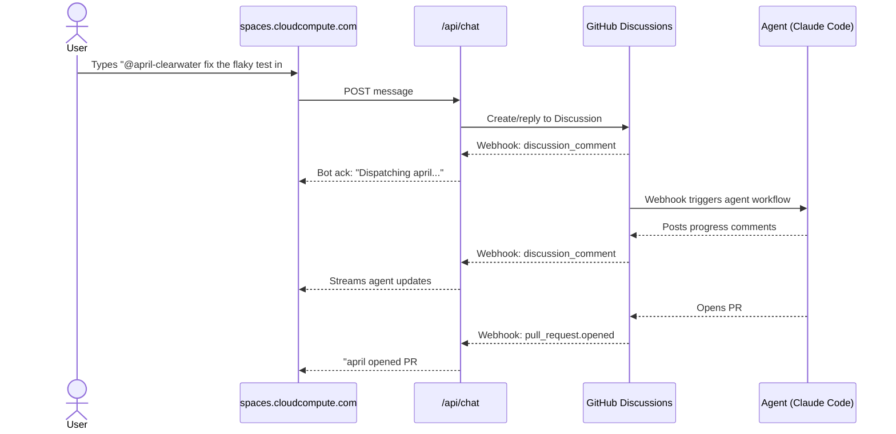
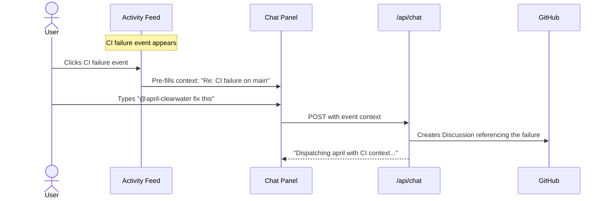
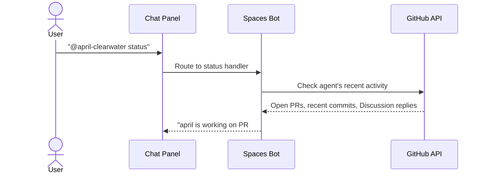

# Spaces Chat & Agent Dispatch — User Stories

## Product Context

Spaces is a web dashboard for managing AI coding agents. It shows repos, agent teams, pipeline status, and webhook activity. We're adding a chat interface that lets you dispatch agents by @mentioning them and see their work stream back as messages.

---

## Story 1: Dispatch an Agent from the Dashboard

**As a** developer viewing a repo's agent team
**I want to** @mention an agent with a task description
**So that** work gets dispatched without leaving the browser

### Flow Diagram



### Chosen Layout: Chat as tab in main panel (Option C)

```
┌─────────────────────────────────────────────────────────────┐
│  Spaces                                    [avatar] Michael │
├──────────┬──────────────────────────────────┬───────────────┤
│ Repos    │ fairchild/workspaces             │ Activity      │
│          │                                  │               │
│ > works… │ [Overview] [Agents] [Chat]       │ [CI] 3 commits│
│   beads  │                                  │ [PR] #243     │
│          │ ┌─────────────────────────────┐  │               │
│          │ │                             │  │               │
│          │ │ 10:32 CI failed on main     │  │               │
│          │ │                             │  │               │
│          │ │ 10:34 you                   │  │               │
│          │ │ @april-clearwater           │  │               │
│          │ │ fix flaky test in #234      │  │               │
│          │ │                             │  │               │
│          │ │ 10:34 april                 │  │               │
│          │ │ On it. Investigating...     │  │               │
│          │ │                             │  │               │
│          │ │ 10:41 april                 │  │               │
│          │ │ PR #245 ready for review    │  │               │
│          │ │                             │  │               │
│          │ └─────────────────────────────┘  │               │
│          │ [@april-clearwater] fix flaky... │               │
│          │ [Send]                           │               │
└──────────┴──────────────────────────────────┴───────────────┘
```

**Why this works:**
- Chat gets the full main panel width — room for message content, code blocks, status cards
- Activity feed stays visible on the right as a parallel event stream
- Tab navigation is already the natural pattern (Overview / Agents / Pipeline sections become tabs)
- Chat tab can show an unread badge when new messages arrive while viewing other tabs
- No layout mechanics change — just a new tab content area

### Steps

1. **Select repo** — sidebar scopes chat to that repo's agents
2. **Open chat** — via tab, panel, or drawer depending on layout choice
3. **Type message with @mention** — autocomplete suggests known agents
4. **Message sent** — POST to API, which creates a GitHub Discussion comment
5. **Bot acknowledges** — "Dispatching april to fix #234..."
6. **Agent works** — progress updates stream back via webhook → chat
7. **Agent completes** — PR link, status update appear in chat

---

## Story 2: React to a CI Failure Conversationally

**As a** developer who just saw a CI failure in the activity feed
**I want to** click on it and say "fix this" or "retry"
**So that** I can respond to events without context-switching to GitHub

### Flow Diagram



### ASCII Wireframe

```
┌───────────────────────────────────────────────────────┐
│ Activity                                              │
│                                                       │
│ [CI] ✗ Tests failed on main           2m ago          │
│       └─ [Reply: @april-clearwater]                   │
│          fix this                         [Retry]     │
│                                                       │
│ [PR] opened #243: feat(web)...        5m ago          │
│ [PUSH] 3 commits to main             12m ago          │
└───────────────────────────────────────────────────────┘
```

### Steps

1. **CI failure appears** in activity feed
2. **Hover/expand** reveals quick actions: Reply, Retry
3. **Reply opens chat** with event context pre-filled
4. **User @mentions agent** — dispatches with full CI failure context
5. **Agent receives** failure logs, branch info, test output

---

## Story 3: Check Agent Status Mid-Task

**As a** developer who dispatched an agent 20 minutes ago
**I want to** ask "what's your status?" in chat
**So that** I can see progress without checking GitHub

### Flow Diagram



### ASCII Wireframe

```
┌─────────────────────────────────────────┐
│ Chat — fairchild/workspaces             │
│                                         │
│ [you] @april-clearwater                 │
│       status                             │
│                                         │
│ [spaces] april — Active                 │
│ ┌─────────────────────────────────────┐ │
│ │ Task: fix flaky test #234           │ │
│ │ Branch: fix/flaky-test-234          │ │
│ │ PR: #245 (3 commits, CI running)    │ │
│ │ Last activity: 3m ago               │ │
│ └─────────────────────────────────────┘ │
│                                         │
│ [@april-clearwater] ...      [Send]     │
└─────────────────────────────────────────┘
```

### Steps

1. **User types** `@april-clearwater status` or `@status` for all agents
2. **Bot queries** GitHub API for agent's recent activity
3. **Bot responds** with structured status card inline in chat
4. **No agent dispatched** — this is a bot query, not a task

---

## Story 4: Global Chat (No Repo Selected)

**As a** developer arriving at the dashboard
**I want to** see a global chat stream before selecting a repo
**So that** I can catch up on cross-repo activity and dispatch work immediately

### ASCII Wireframe

```
┌──────────┬──────────────────────────────────┬───────────────┐
│ Repos    │ Welcome back, Michael            │ All Activity  │
│          │                                  │               │
│   works… │ Recent conversations:            │ [PR] #243     │
│   beads  │                                  │ [CI] ✗ main   │
│   bread  │ workspaces — @april-clearwater   │ [PUSH] beads  │
│          │ fixing #234                      │               │
│   jrnl…  │ beads — @peter planning sprint   │               │
│          │                                  │               │
│          │ Quick dispatch:                  │               │
│          │ ┌─────────────────────────────┐  │               │
│          │ │ @agent repo:workspaces ...  │  │               │
│          │ └─────────────────────────────┘  │               │
│          │ [Send]                           │               │
└──────────┴──────────────────────────────────┴───────────────┘
```

### Steps

1. **Arrive at dashboard** — no repo selected
2. **See recent conversations** across all repos
3. **Quick dispatch** with `@agent repo:workspaces <task>` syntax
4. **Or select a repo** to scope the view

---

## Story 5: Agent Autocomplete and Dispatch Confirmation

**As a** developer typing a message
**I want to** see agent names autocomplete when I type @
**So that** I dispatch to the right agent and see what they can do

### ASCII Wireframe

```
┌─────────────────────────────────────────┐
│ [@ap                                    │
│ ┌─────────────────────────────────────┐ │
│ │ ● april — CI/CD, releases, fixes   │ │
│ │ ○ peter-planner — Planning, specs   │ │
│ └─────────────────────────────────────┘ │
│                                         │
│ After selecting april:                  │
│                                         │
│ [@april-clearwater] fix flaky #234      │
│                                         │
│ ┌─ Dispatch confirmation ────────────┐  │
│ │ Agent: april (● active)            │  │
│ │ Repo: fairchild/workspaces         │  │
│ │ Task: fix the flaky test in #234   │  │
│ │                                    │  │
│ │ This will create a GitHub          │  │
│ │ Discussion and dispatch april.     │  │
│ │                                    │  │
│ │ [Cancel]              [Dispatch]   │  │
│ └────────────────────────────────────┘  │
└─────────────────────────────────────────┘
```

### Steps

1. **Type @** — autocomplete dropdown appears with repo's agents
2. **Select agent** — name inserted into message
3. **Submit** — dispatch confirmation dialog shows agent, repo, task
4. **Confirm** — message sent, Discussion created, agent dispatched
5. **Skip confirmation** — power user setting to dispatch immediately
