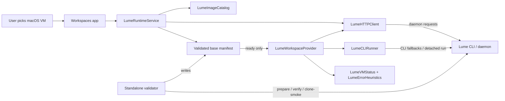
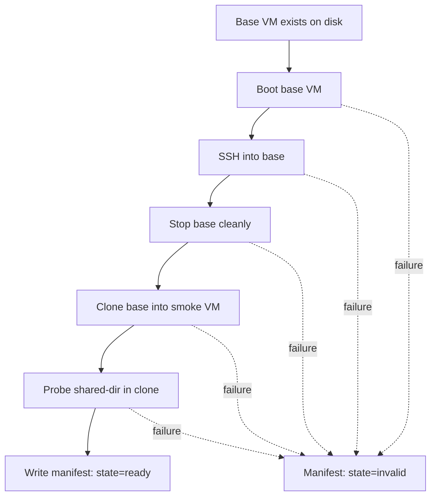

# Lume Integration Contract

This document describes how Workspaces integrates with Lume **today**.

Read this when you need to answer any of these questions:

- what part of the system owns Lume installation and health
- what makes a macOS base VM trusted
- where Workspaces-managed Lume artifacts live
- how the standalone validator and the Swift app relate
- which unattended profile is used for stock Tahoe base preparation

For the broader provider model, see [../vm-provider-architecture.md](../vm-provider-architecture.md). For the runnable validation steps, see [lume-validation.md](./lume-validation.md). For the exact recreate-from-scratch and troubleshooting workflow, see [lume-recreate-runbook.md](./lume-recreate-runbook.md). For running GitHub Actions runners inside Lume VMs, see [lume-runner-setup.md](./lume-runner-setup.md).

## High-Level Contract

Workspaces treats Lume as an external runtime.

- Lume owns VM execution.
- The standalone validator owns base-VM proof.
- The Swift app owns setup UX, workspace records, and clone-based workspace creation.



## Ownership Boundaries

| Concern | Owner | Notes |
| --- | --- | --- |
| Install Lume CLI, verify daemon, show repair flow | Swift app | First-use setup and Settings UI |
| Detect host profile and resolve default image | Swift runtime + `LumeImageCatalog` | Shared with standalone scripts by convention |
| Prove a base can boot, get IP, and accept SSH | Standalone validator | This is a hard gate |
| Mark a base `ready` | Standalone validator only | The app never self-certifies a base |
| Clone base into a workspace VM | Swift app | Fast path only |
| Fall back to slow stock macOS install | Standalone validator | Used to prepare a base, not a normal workspace |

## Swift Runtime Surfaces

The shipped app now keeps the Lume-specific responsibilities on smaller, typed seams instead of duplicating transport and subprocess logic inside the two main actors.

| Type | Responsibility |
| --- | --- |
| `LumeRuntimeService` | install/repair flow, daemon health, host profile, validated-base inspection |
| `LumeWorkspaceProvider` | workspace lifecycle orchestration, shared-dir launch specs, status sync |
| `LumeHTTPClient` | canonical `/lume/...` URL construction plus daemon request/response handling |
| `LumeCLIRunner` | shared `lume` subprocess execution, streaming CLI transcripts, detached macOS `lume run` launch |
| `LumeImageCatalog` | host-profile to golden-image resolution |
| `LumeVMStatus` | normalized VM lifecycle states (`running`, `stopped`, `provisioning`, etc.) |
| `LumeErrorHeuristics` | shared missing-VM and fallback/retry message classification |

## Validated Base Contract

A base VM is trusted only when all of these are true:

1. It lives in the `workspaces-validated-base-macos-<profileKey>` namespace.
2. Lume CLI can resolve it from Workspaces-managed storage.
3. The standalone validator booted it to an IP address.
4. `lume ssh` succeeded against that base.
5. The validator stopped it cleanly.
6. A disposable clone also booted to SSH and could read the shared host directory.
7. The validator wrote a manifest with `state = "ready"`.

If any of those checks fail, the base is `invalid`, even if VM files still exist on disk.



## Storage Layout

Workspaces does not use the default `~/.lume` path for its managed VMs.

```text
~/Library/Application Support/WorkspaceManager/
├── LumeStorage/
│   ├── validated-bases/    # canonical long-lived base VMs
│   ├── standalone-smoke/   # disposable validator clone VMs
│   └── workspace-vms/      # app-created workspace VMs
└── LumeValidatedBases/
    └── <vmName>.json       # validated-base manifest per host profile
```

This isolation keeps three classes of VM separate:

- validated bases
- disposable validator clones
- user-facing workspace VMs

### Missing `workspaces` storage location

Lifecycle calls for workspace VMs address them through the `workspaces` storage selector (see the storage-selector mapping in `LumeWorkspaceProvider`). That selector only resolves if a `workspaces` storage location is registered in Lume pointing at `workspace-vms/`. If it is not, Lume answers with a 404 that used to surface as a generic "Not found" — most visibly when cleaning up an orphaned VM, where the reconciler has already confirmed the VM directory exists on disk.

Workspace-VM cleanup now maps that not-found to an actionable diagnostic (`LumeErrorHeuristics.missingWorkspacesStorageDiagnostic`): _"The 'workspaces' storage location is not configured in Lume. Run `lume storage list` to verify it exists, then add it before retrying cleanup."_ Run `lume storage list` and confirm a `workspaces` entry resolves to the `workspace-vms/` directory above; if it is absent, re-add it before retrying.

## Standalone Validation Flow

The canonical gate is `./scripts/lume-standalone-validate.sh`.

It runs:

1. preflight
2. verify existing validated base
3. if needed, rebuild base
4. verify rebuilt base to SSH
5. clone smoke
6. write manifest and artifacts

The gate is intentionally outside the Swift app so Lume defects stay attributable to Lume instead of being misdiagnosed as app lifecycle bugs.

## Unattended Profile Policy

Workspaces can override Lume's built-in unattended preset when a host-specific setup issue is known.

Current override policy:

- Workspaces keeps a versioned set of Tahoe profiles under [config/lume/unattended/](../../config/lume/unattended/)
- the current default NAT Tahoe override is [tahoe-workspaces-v26.yml](../../config/lume/unattended/tahoe-workspaces-v26.yml)
- the bridged Tahoe diagnostics override is [tahoe-workspaces-bridged-v27.yml](../../config/lume/unattended/tahoe-workspaces-bridged-v27.yml)
- fallback is still the upstream preset name, for example `preset:tahoe`
- the override set is consumed by the standalone validator and recovery path only
- the current from-scratch recovery helper is [tahoe-workspaces-v18-official-run-bootstrap-ssh.yml](../../config/lume/unattended/tahoe-workspaces-v18-official-run-bootstrap-ssh.yml)

The important current-state detail is that the old `Screen Time` issue is no longer the main blocker. The meaningful runtime behavior now depends on:

- the official signed Lume daemon
- a NAT-backed validated base for normal runs
- guest-side `Remote Login` enabled through System Settings
- an explicit bridged override only when debugging host-network reachability

## Upstream Testing Note

When validating a local upstream Lume patch on this Mac:

- do not use raw `libs/lume/.build/debug/lume` as the standalone-validator target
- use `libs/lume/scripts/install-local.sh` into an isolated install directory and point `LUME_BIN` at that installed binary
- `install-local.sh --no-background-service` unloads the current `com.trycua.lume_daemon` LaunchAgent during cleanup
- after that local install flow, restart the daemon manually or reinstall the LaunchAgent before returning to normal Workspaces validation

This note exists because the raw SwiftPM output has behaved differently from the locally installed binary during VM validation on this host.

## Daemon Reliability

The Lume daemon (`com.trycua.lume_daemon`) must be running for CI, agent workflows, and the app's VM features to work. Without a keepalive mechanism, daemon outages are silent — CI jobs queue indefinitely on the `lume-macos` runner.

### LaunchAgent with KeepAlive

The daemon is managed by a LaunchAgent at `~/Library/LaunchAgents/com.trycua.lume_daemon.plist`:

```xml
<key>KeepAlive</key>
<true/>
<key>RunAtLoad</key>
<true/>
```

`KeepAlive` tells launchd to restart the process if it exits for any reason. `RunAtLoad` starts it on login. This replaces the previous approach of running the daemon in a detached tmux session, which had no crash recovery.

The plist points at the **installed** binary (`~/.local/share/lume/lume.app/Contents/MacOS/lume`), not a debug build. Using a debug build from a local upstream clone (`libs/lume/.build/debug/lume`) caused reliability issues previously — the installed signed binary is the only supported daemon binary.

### Ensure script

`scripts/lume-ensure-daemon.sh` is an idempotent health-check that self-heals the daemon:

1. **Fast path**: `GET /lume/host/status` responds → exit 0
2. **Load**: LaunchAgent plist exists → `launchctl load` → wait up to 15s
3. **Create**: plist missing → write it with `KeepAlive` → load → wait
4. **Direct start**: all else fails → `nohup lume serve` as fallback

Call it anywhere a healthy daemon is a precondition:

```bash
# mise task
mise run dev-lume-ensure

# CI pre-step in a workflow
- name: Ensure Lume daemon
  run: ./scripts/lume-ensure-daemon.sh

# cron watchdog (every 5 minutes)
*/5 * * * * /path/to/scripts/lume-ensure-daemon.sh LUME_QUIET=1
```

### Diagnosing daemon issues

```bash
# Is the daemon responding?
curl -sf http://127.0.0.1:7777/lume/host/status

# Is the LaunchAgent loaded?
launchctl list | grep lume

# What process is serving port 7777?
lsof -nP -iTCP:7777 -sTCP:LISTEN

# Daemon logs
tail -50 ~/Library/Logs/lume/daemon.log
tail -50 ~/Library/Logs/lume/daemon.error.log

# Nuclear recovery: bootout + bootstrap (modern launchctl for macOS 14+)
launchctl bootout gui/$(id -u)/com.trycua.lume_daemon 2>/dev/null || true
launchctl bootstrap gui/$(id -u) ~/Library/LaunchAgents/com.trycua.lume_daemon.plist
```

### Common failure modes

| Symptom | Cause | Fix |
| --- | --- | --- |
| CI jobs stuck in `queued` | Daemon down, runner offline | `mise run dev-lume-ensure` |
| Daemon running but wrong binary | Stale tmux session with debug build | Kill tmux, reload LaunchAgent |
| LaunchAgent plist missing | Upstream `install-local.sh --no-background-service` removed it | `./scripts/lume-ensure-daemon.sh` recreates it |
| Port 7777 in use by something else | Conflicting process | `lsof -nP -iTCP:7777` to identify, kill it |

## Failure Artifacts

Standalone validation artifacts live under:

- `output/lume-standalone/latest`
- `output/lume-standalone/<timestamp>`

The most important files are:

- `summary.md`
- `status.json`
- `prepare-base.log`
- `base-get-running.json`
- `clone-get-running.json`
- `ssh-probe-base.txt`
- `ssh-probe-clone.txt`
- `daemon.log`
- `daemon.error.log`
- `unattended-debug/` when stock base preparation used `--debug --debug-dir`

`status.json` is the run artifact. The manifest under `~/Library/Application Support/WorkspaceManager/LumeValidatedBases/` is the runtime contract the app trusts.

## Current Known-Good Status

As of March 11, 2026, the meaningful state is:

- the validated base can boot to a real LAN IP and pass a direct SSH probe
- a disposable clone can boot, reach a real LAN IP, pass a direct SSH probe, and read a shared host directory
- the standalone validator is green on this host
- the app-backed host smoke is also green on this host

The specific gap is:

- some bridged-mode runs have reported `ipAddress: null` and `sshAvailable: null` even though the guest was healthy
- other verified runs now report the correct `ipAddress` and `sshAvailable: true`
- guest-side `ipconfig getifaddr en0` and direct SSH remain the fallback source of truth when daemon status is incomplete

Operationally, that means:

- NAT is the default network for normal validation and app-managed workspace boots
- bridged guest IP plus direct SSH remains the fallback source of truth on the diagnostics path
- daemon-side `null` IP must not be treated as immediate guest failure on the bridged path

For the exact commands and troubleshooting sequence, use [lume-recreate-runbook.md](./lume-recreate-runbook.md).

## Current Operational Workaround

The current diagnostics path is deliberately narrower than the normal NAT-backed contract:

1. use the official installed and signed Lume runtime
2. run a dedicated daemon on port `7778`
3. boot the base or clone with `network: "bridged:en0"` only when investigating host-network reachability
4. enable `Remote Login` through System Settings when the guest first reaches desktop
5. use guest-side checks and direct SSH as the runtime truth
6. treat daemon `ipAddress: null` as an observability problem unless guest-side checks also fail

This matters because it explains the current split:

- the guest can be usable
- the app or validator can still look red if they trust daemon-side IP discovery too early
- the current green path therefore uses CLI and direct guest checks as needed, not daemon status alone

## Failure Classification

When debugging this integration, classify failures in this order:

1. `install / entitlement`
   - official installed runtime missing
   - missing virtualization or VM networking entitlements
2. `guest bring-up`
   - unattended setup does not reach a usable desktop
   - guest never gets a usable IP
   - `sshd` is not enabled
3. `runtime observability`
   - guest is healthy, but daemon `ipAddress` / `sshAvailable` remain null
4. `Workspaces integration`
   - standalone / manual runtime proof is green, but app creation or attach still fails

Do not collapse `runtime observability` into `guest failure`. On this host, that distinction matters.

## App Integration Rules

The Swift app must follow these rules:

- it may reuse only a base whose manifest is `state=ready`
- it may not silently prepare a new base during normal workspace creation
- it should treat a missing or invalid base as an actionable setup/runtime condition
- it should create workspace VMs only in `workspace-vms/`, unless same-storage clone reuse is required to preserve a known-good fast path on this host
- it should fall back to CLI `lume get --storage ... -f json` when daemon VM lookup fails for custom storage
- it should use the shared `LumeCLIRunner` detached `lume run` path for macOS clone boot; the shipped app no longer depends on a Python detacher
- it should normalize daemon/CLI VM lifecycle strings through `LumeVMStatus` and classify shared retry/missing-VM messages through `LumeErrorHeuristics`

That keeps the app fast-path small:

```text
resolve host profile
-> read validated-base manifest
-> clone ready base
-> run clone with shared host workspace
-> wait for SSH
-> attach terminal / expose desktop
```

## Operational Guidance

When debugging a macOS VM issue, do this in order:

1. run the standalone validator
2. inspect the unattended debug artifacts if base prep used stock install
3. inspect daemon logs
4. only then run the app-backed host smoke

Do not debug app-level `waiting for SSH` behavior until the standalone validator can:

- boot the base
- SSH into the base
- clone the base
- SSH into the clone

Current additional rule:

- if the runtime path uses bridged networking, verify guest reachability by direct guest IP and SSH before trusting daemon `ipAddress` / `sshAvailable`
