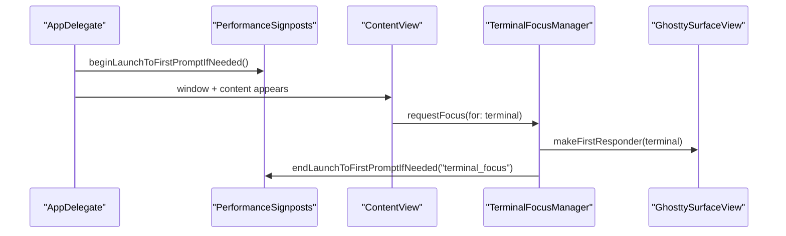
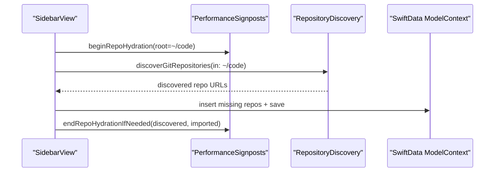
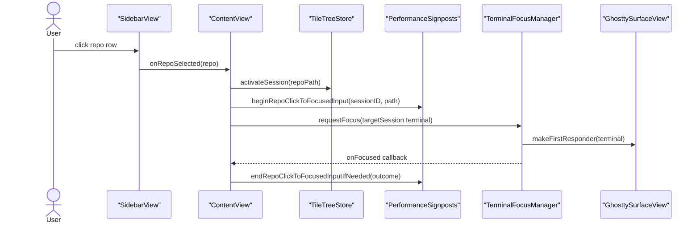
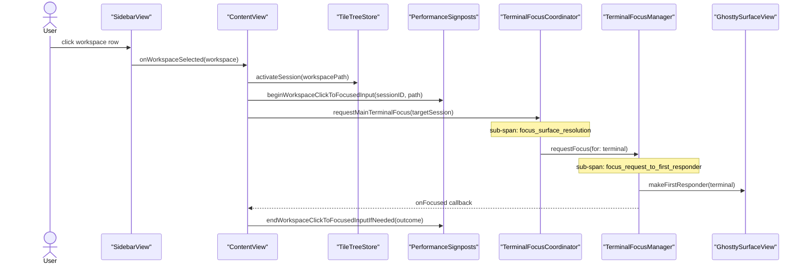
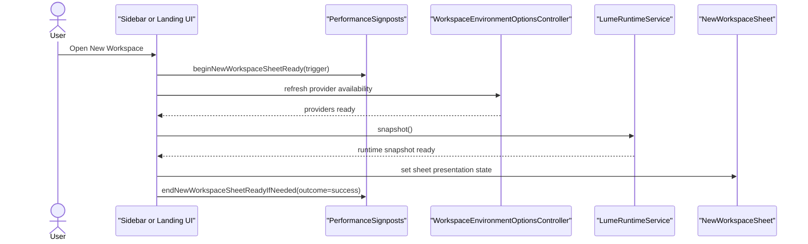
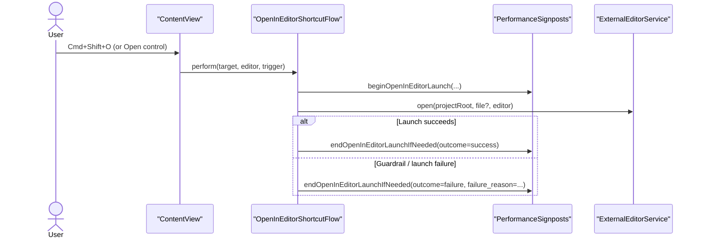

# Performance Metrics Reference

This page explains what each dashboard metric means, where timing starts/ends, and the runtime flow being measured.

The machine-readable source of truth for scenarios, metric coverage, and budget formulas is:

- `config/performance/contract.json`

Canonical scenarios:

| Scenario | Build Kind | Purpose |
|---|---|---|
| `debug_no_activate` | `debug` | Raw SwiftPM debug startup without app activation; use for branch deltas and trend history, not release signoff |
| `debug_activate` | `debug` | Interactive debug startup timing with normal activation |
| `installed_clean_shell` | `installed` | Packaged-app release signoff with shell init bypassed and bundled Ghostty resources verified |
| `installed_login_shell` | `installed` | Installed-app startup with normal login shell cost included |
| `installed_input_short_capture` | `installed` | Short focused typing capture for input event age and handler timing |
| `main_window_agent_activity_burst` | `debug` | In-process sidebar status aggregation burst for agent activity churn |
| `main_window_session_switcher_snapshot` | `debug` | In-process Session Switcher snapshot construction and query ranking |
| `main_window_workspace_create_ui_stall` | `debug` | New Workspace sheet-open flow, including provider availability and Lume runtime refresh submetrics |
| `main_window_idle_cpu_diagnostics_closed` | `debug` | Debug app idle CPU while the Diagnostics pane is closed |
| `main_window_resident_memory_20_workspaces` | `debug` | Debug app RSS after prewarming 20 retained terminal surfaces |

## Metric Definitions

### `launch_to_first_prompt`

What it measures:
- Time from app launch initialization to the first successful terminal focus (ready for typing).

Start event:
- `PerformanceSignposts.beginLaunchToFirstPromptIfNeeded()` in app launch path.

End event:
- `PerformanceSignposts.endLaunchToFirstPromptIfNeeded(trigger: "terminal_focus")` when focus manager successfully sets terminal first responder.
- Installed no-activation captures may also end when terminal prompt readiness is
  observed through the terminal title path before foreground focus is possible.

Why it matters:
- This is the “is the app immediately usable?” number.

### `repo_hydration`

What it measures:
- Time spent auto-discovering repositories under `~/code` and importing any missing repo entries into model state.

Start event:
- `PerformanceSignposts.beginRepoHydration(rootPath:)` before discovery.

End event:
- `PerformanceSignposts.endRepoHydrationIfNeeded(discoveredCount:importedCount:)` after discovery + import pass completes.

Why it matters:
- It captures startup portfolio load cost.

### `repo_click_to_focus`

What it measures:
- Time from selecting a repo row to terminal focus being restored for that repo session.

Start event:
- `PerformanceSignposts.beginRepoClickToFocusedInput(sessionID:repoPath:)` in `handleRepoSelection`.

End event:
- `PerformanceSignposts.endRepoClickToFocusedInputIfNeeded(...)` when focus callback confirms terminal became first responder.

Why it matters:
- It reflects interaction responsiveness during context switching.

Notes:
- Current flow uses immediate focus request plus a short retry; a successful
  restore ends with outcome `focused` (or `prompt_ready` via the terminal
  readiness signal).
- Only `outcome=prompt_ready` and `outcome=focused` are measured latency. Any
  other termination (user navigated away, selection superseded) is an abandoned
  interval: the cancel path logs `status=abandoned elapsed_ms=...` instead of
  `duration_ms=...`, and `perf-baseline.sh` additionally allowlists the success
  outcomes so abandoned idle time can never enter the median/mean pool.
- `debug_no_activate` intentionally does not gate this metric. Shared-desktop
  no-activation mode skips foreground focus, and automation can reuse a
  prompt-ready terminal before the repo-selection timer has a foreground focus
  callback to complete. Use `debug_activate` when validating repo-switch focus
  timing.

### `workspace_click_to_focus`

What it measures:
- Time from selecting a workspace row to terminal focus being restored for that workspace session.

Start event:
- `PerformanceSignposts.beginWorkspaceClickToFocusedInput(sessionID:workspacePath:)` in `handleWorkspaceSelection`.

End event:
- `PerformanceSignposts.endWorkspaceClickToFocusedInputIfNeeded(...)` when focus callback confirms terminal became first responder.

Why it matters:
- It reflects interaction responsiveness when switching between workspaces, analogous to `repo_click_to_focus` for repo switches.

Sub-spans (emitted via `InvestigationDiagnostics.emitFocus`):
- `focus_surface_resolution` — from `requestMainTerminalFocus` call to terminal resolved from `surfaceStore.terminal(for:)`
- `focus_request_to_first_responder` — from `TerminalFocusManager.requestFocus()` call to `makeFirstResponder` success

Notes:
- Mirrors the `repo_click_to_focus` pattern exactly, including abandonment
  semantics: only `outcome=prompt_ready` / `outcome=focused` intervals carry
  `duration_ms`; cancelled or superseded intervals log
  `status=abandoned elapsed_ms=...` and are excluded from latency summaries.
- `debug_no_activate` intentionally does not gate this metric. Shared-desktop
  no-activation mode skips foreground focus, and automation can reuse a
  prompt-ready terminal before the workspace-selection timer has a foreground
  focus callback to complete. Use `debug_activate` when validating workspace
  switch focus timing.

### `new_workspace_sheet_ready`

What it measures:
- Time from a user-initiated New Workspace action to the sheet being ready for interaction after provider/runtime refresh work finishes.

Start event:
- `PerformanceSignposts.beginNewWorkspaceSheetReady(trigger:)` at the two production entry points:
  - `SidebarView.prepareNewWorkspaceSheet(for:)`
  - `ContentView.presentNewWorkspaceFromLanding(_:)`

End event:
- `PerformanceSignposts.endNewWorkspaceSheetReadyIfNeeded(attemptID:outcome:)` after the environment options refresh work completes and the sheet presentation state is set.

Why it matters:
- This isolates the deferred cost that was moved off app launch so startup can stay responsive without hiding the user-facing cost of opening the sheet.

Trigger field:
- `trigger=sidebar|landing`

Outcome field:
- `outcome=success|superseded`
- `superseded` means a second sheet-open attempt replaced the first before the first one completed; the old interval is closed and should not be treated as a successful ready signal.

Notes:
- This metric is intentionally not in `metrics-history.csv` or the shared dashboard yet. Use the dedicated benchmark script and dated reports until the signal proves stable enough to gate routinely.

### `main_window_agent_activity_burst_sidebar_latency_ms`

What it measures:
- Time spent rebuilding sidebar agent-status inputs and updating `WorkspaceStatusAggregator` for a bursty main-window workload.

Scenario:
- `main_window_agent_activity_burst`

Why it matters:
- It guards the path that refires when agent session status changes, where repeated sidebar refresh work can become visible during active agent sessions.

### `main_window_attention_dropdown_resolution_ms`

What it measures:
- Time spent resolving `WorkspaceStatusAggregator.attentionItems` into the concise rows used by the top-right "Needs You" dropdown.

Scenario:
- `main_window_agent_activity_burst`

Why it matters:
- It guards the click-prep path for the notification bubble so the dropdown stays cheap even when agent status changes rapidly across many tabs.

### `main_window_session_switcher_snapshot_ms`

What it measures:
- Time spent building Session Switcher rows from already-loaded repos, web sources, host sessions, pane counts, and agent statuses, then filtering/ranking them for a query.

Scenario:
- `main_window_session_switcher_snapshot`

Why it matters:
- It keeps Cmd-P opening and search responsive as live agent/session metadata grows.

### `workspace_provider_availability_refresh`

What it measures:
- The provider availability refresh span emitted while preparing the New Workspace sheet.

Scenario:
- `main_window_workspace_create_ui_stall`

Why it matters:
- It separates provider option refresh cost from the final sheet-ready marker.

### `lume_runtime_snapshot_refresh`

What it measures:
- The Lume runtime snapshot refresh span used while preparing New Workspace environment options.

Scenario:
- `main_window_workspace_create_ui_stall`

Why it matters:
- It captures the deferred runtime-readiness work that can make workspace creation feel stalled even when the final sheet presentation marker is short.

### `main_window_idle_cpu_diagnostics_closed_percent`

What it measures:
- `WorkspaceManager` process CPU percent sampled from the debug app while the Diagnostics pane is closed.

Scenario:
- `main_window_idle_cpu_diagnostics_closed`

Why it matters:
- It verifies that diagnostics sampling and ordinary idle work stay quiet during sustained sessions when the diagnostics UI is not visible.

### `main_window_resident_memory_20_workspaces_mb`

What it measures:
- `WorkspaceManager` process RSS after the debug app prewarms and retains 20 terminal surfaces.

Scenario:
- `main_window_resident_memory_20_workspaces`

Why it matters:
- It establishes a contract around retained terminal surface memory before adding any eviction or suspension policy.

### `open_in_editor_launch`

What it measures:
- Time from `Open in Editor` invocation to editor process launch return (`Process.run()` success or failure).

Start event:
- `PerformanceSignposts.beginOpenInEditorLaunch(...)` in `OpenInEditorShortcutFlow.perform(...)`.

End event:
- `PerformanceSignposts.endOpenInEditorLaunchIfNeeded(...)` on launch success or failure.

Why it matters:
- This is the user-facing latency for the `Cmd+Shift+O` hero flow.
- It also records guardrail outcomes for launch failures with categorized reasons.

Outcome + guardrail fields:
- `outcome=success|failure`
- `failure_reason` (only when `outcome=failure`):
  - `project_root_not_found`
  - `file_not_found`
  - `file_outside_project`
  - `editor_not_installed`
  - `editor_cli_unavailable`
  - `launch_failed`
  - `unexpected_error`

Trigger field:
- `trigger=shortcut|uiPrimaryAction|uiMenuSelection|unknown`

## Budget Contract

Budgets are derived from the reference baselines in `config/performance/contract.json` using one formula everywhere:

- gate budget: `ceil(reference median * 1.25)`
- diagnostic threshold: `ceil(reference p95 * 1.5)`

Rules:

- median is the gating statistic
- p95 is diagnostic and should trigger investigation even when median still passes
- existing `[Perf]` metric names remain the raw telemetry source; contract logic sits above them
- debug scenario budgets are release-advisory only; a debug failure does not
  block a release when installed-build verification passes and the difference is
  classified in the release notes or PR context

Enforcement points:

- `./scripts/perf-baseline.sh --assert-budget`
- `./scripts/perf-runner.sh --scenario <id> --assert-budget`

Both run on the owner's laptop, opt-in per approved session — budgets are
`Mac16,13`-derived, so nothing off-host may assert them. No CI workflow enforces
them; see [../decisions/perf-measurement-laptop-optin.md](../decisions/perf-measurement-laptop-optin.md).

Release signoff uses installed-build verification:

- `./scripts/verify-release-bundle.sh`
- `./scripts/verify-installed-perf.sh`

`verify-installed-perf.sh` must confirm bundled Ghostty resources, bundled
terminfo, `terminal_first_output`, and `first_prompt_ready`. These installed
metrics are the release-relevant signal for packaged app startup.

## Interpreting Dashboard Changes

1. Small run-to-run movement is normal (scheduler/window focus variance).
2. Regressions to investigate:
- sustained increases over multiple recorded runs
- crossing target thresholds
- sudden jump with no corresponding product change
3. Compare with context:
- repo count discovered/imported
- machine and OS build
- run settings (`runs`, `sleep`)
