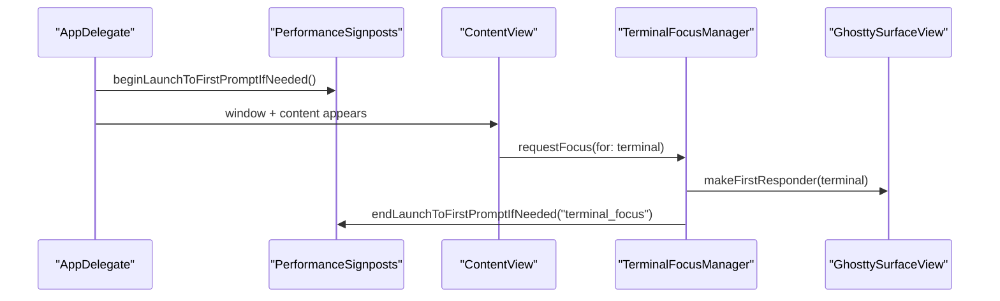
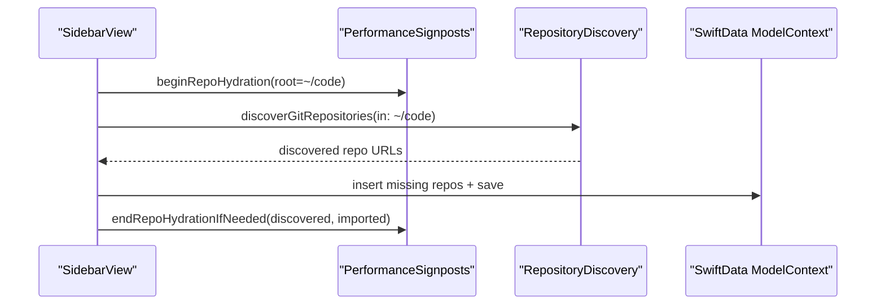
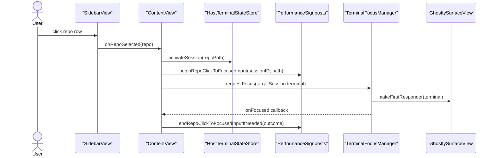
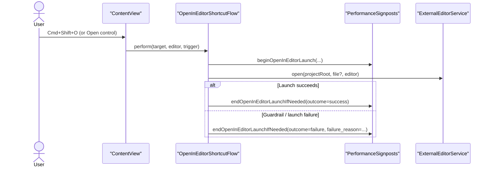

# Performance Metrics Reference

This page explains what each dashboard metric means, where timing starts/ends, and the runtime flow being measured.

## Metric Definitions

### `launch_to_first_prompt`

What it measures:
- Time from app launch initialization to the first successful terminal focus (ready for typing).

Start event:
- `PerformanceSignposts.beginLaunchToFirstPromptIfNeeded()` in app launch path.

End event:
- `PerformanceSignposts.endLaunchToFirstPromptIfNeeded(trigger: "terminal_focus")` when focus manager successfully sets terminal first responder.

Why it matters:
- This is the “is the app immediately usable?” number.

### `repo_hydration`

What it measures:
- Time spent auto-discovering repositories under `~/code` and importing any missing repo entries into model state.

Start event:
- `PerformanceSignposts.beginRepoHydration(rootPath:)` before discovery.

End event:
- `PerformanceSignposts.endRepoHydrationIfNeeded(discoveredCount:importedCount:)` after discovery + import pass completes.

Why it matters:
- It captures startup portfolio load cost.

### `repo_click_to_focus`

What it measures:
- Time from selecting a repo row to terminal focus being restored for that repo session.

Start event:
- `PerformanceSignposts.beginRepoClickToFocusedInput(sessionID:repoPath:)` in `handleRepoSelection`.

End event:
- `PerformanceSignposts.endRepoClickToFocusedInputIfNeeded(...)` when focus callback confirms terminal became first responder.

Why it matters:
- It reflects interaction responsiveness during context switching.

Notes:
- Current flow uses immediate focus request plus a short retry. You may see outcome `focused_retry`, which still means focus was successfully restored.

### `open_in_editor_launch`

What it measures:
- Time from `Open in Editor` invocation to editor process launch return (`Process.run()` success or failure).

Start event:
- `PerformanceSignposts.beginOpenInEditorLaunch(...)` in `OpenInEditorShortcutFlow.perform(...)`.

End event:
- `PerformanceSignposts.endOpenInEditorLaunchIfNeeded(...)` on launch success or failure.

Why it matters:
- This is the user-facing latency for the `Cmd+Shift+O` hero flow.
- It also records guardrail outcomes for launch failures with categorized reasons.

Outcome + guardrail fields:
- `outcome=success|failure`
- `failure_reason` (only when `outcome=failure`):
  - `project_root_not_found`
  - `file_not_found`
  - `file_outside_project`
  - `editor_not_installed`
  - `editor_cli_unavailable`
  - `launch_failed`
  - `unexpected_error`

Trigger field:
- `trigger=shortcut|uiPrimaryAction|uiMenuSelection|unknown`

## Interpreting Dashboard Changes

1. Small run-to-run movement is normal (scheduler/window focus variance).
2. Regressions to investigate:
- sustained increases over multiple recorded runs
- crossing target thresholds
- sudden jump with no corresponding product change
3. Compare with context:
- repo count discovered/imported
- machine and OS build
- run settings (`runs`, `sleep`)
