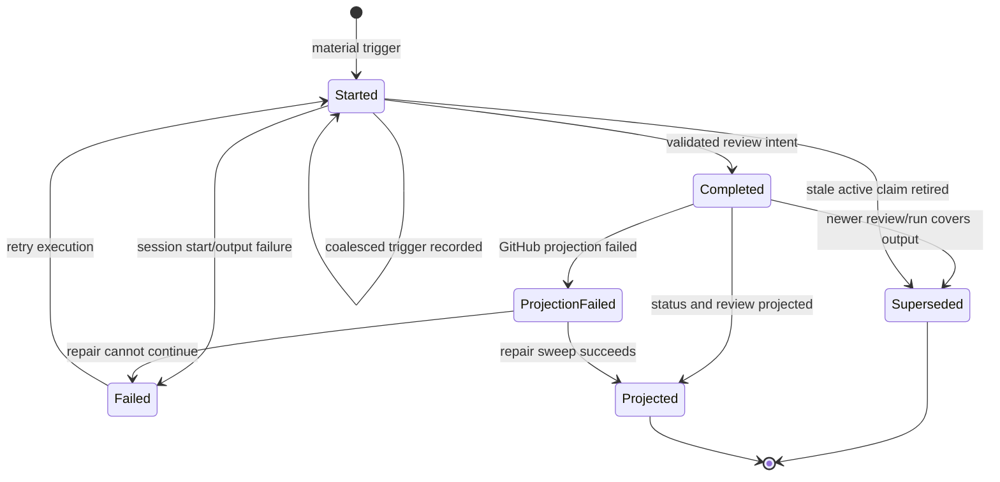
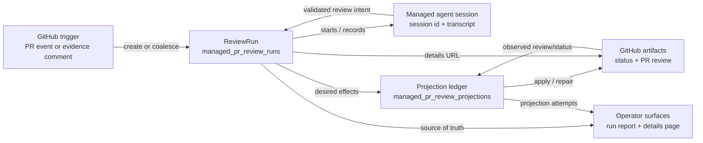

# Managed Reviewer Architecture

The managed PR reviewer is a ReviewRun-centered system. GitHub activity starts
or coalesces a durable run, the managed agent produces a review intent, and the
broker projects the completed run back to GitHub. Operator surfaces read from
the same run record so a missing, pending, failed, or stale review can be
diagnosed from one vocabulary.

## Vocabulary

| Term | Meaning |
|------|---------|
| ReviewRun | The durable row in `managed_pr_review_runs` for one reviewer attempt. It stores the PR, head SHA, trigger, reviewer config hash, managed-agent session id, execution status, review intent, projection status, failure metadata, coalesced trigger fields, and details-page fingerprint. |
| Trigger | A material GitHub event that should review or re-review a PR: PR opened, reopened, ready for review, synchronize, eligible body/base edits, or evidence-bearing PR comments. Metadata-only events are ignored. |
| Coalesced state | A burst state where a new material trigger arrives while a same-repo, same-PR, same-reviewer-config run is active. The active run keeps executing, records the latest coalesced head and trigger fields, and the broker starts one follow-up run for the latest PR state after retiring the older active run. |
| Current head | The latest PR head SHA known to the reviewer system for the PR. A run's `head_sha` is the head it started from; `coalesced_head_sha` becomes the latest known head when later activity coalesces into the run. |
| Superseded run | A run intentionally retired because newer review activity covers it. Superseded runs are terminal and should not be retried. |
| Completed run | A run whose managed-agent execution finished and stored a validated review intent. Completion is not the same as publication; `projection_status` shows whether GitHub has been updated. |
| Projection | A GitHub-facing effect derived from a ReviewRun, currently the `WorkSpaces Managed Review` commit status and the posted GitHub PR review. Projections are tracked on the run and in `managed_pr_review_projections`. |
| Repair sweep | A broker or operator-initiated pass that re-applies missing or failed GitHub projection from a completed ReviewRun without rerunning the agent. |
| Health audit | A read-only check of ReviewRun coverage, SLOs, failures, and projection drift. The first operator command is [`uv run --script scripts/pr-reviewer-runs.py`](../../scripts/pr-reviewer-runs.py); the GitHub-facing projection audit remains [`scripts/pr-review-health.py`](../../scripts/pr-review-health.py). |

## State Machine

`status` tracks managed-agent execution: `started`, `completed`, `failed`, or
`superseded`. `projection_status` tracks GitHub projection: `pending`,
`projected`, `failed`, or `superseded`. The projection ledger adds per-effect
states: `pending`, `projecting`, `projected`, `failed`, and `superseded`.

## Relationships

The run fingerprint is the stable id for details URLs and idempotency. The
projection ledger is a repair record, not a second source of truth.

## Runtime Paths

### Happy Path

1. GitHub sends a material trigger through the Cloudflare relay to the Vercel
   webhook route.
2. The route verifies the webhook, classifies the trigger, inserts a ReviewRun,
   and posts a pending `WorkSpaces Managed Review` commit status whose details
   URL points to `/dashboard/review-runs/<fingerprint>`.
3. The runtime starts a managed-agent session and stores its session id on the
   run.
4. The broker reads the completed session, validates the review-intent JSON,
   stores the intent, posts the GitHub PR review, and updates the status to
   success.
5. The run becomes `status=completed` and `projection_status=projected`.

### Stale Or Superseded Path

When a material trigger arrives while a same-config run is active, the system
updates the active run's coalesced fields instead of starting parallel work.
The broker suppresses the older output, marks the older run superseded, and
starts one follow-up run against the latest known PR state. If a completed
session is already covered by a newer managed review, the broker also marks it
superseded instead of posting stale output.

### Failed Execution Path

Execution failures happen before a validated review intent exists: session
creation failed, session output could not be read, PR metadata was unavailable,
or the returned intent was invalid. The run records `status=failed`, a
`failure_kind`, retryability, and a sanitized failure message. Retry execution
from the run details surface only when the run still targets the current PR
head and the failure is retryable.

### Failed Projection Path

Projection failures happen after the run has a validated review intent but
GitHub could not be updated. The run stays completed, records
`projection_status=failed`, and stores projection errors on the run and ledger.
Repair projection from the run details surface reuses the stored intent and
does not rerun the managed agent.

## Operator Triage

Use this order when a PR looks wrong:

| PR symptom | First surface | What to check |
|------------|---------------|---------------|
| No review | [`uv run --script scripts/pr-reviewer-runs.py`](../../scripts/pr-reviewer-runs.py) | Look for `missingRuns`, `starting`, `stuckStarting`, or `runningTooLong`. If a run exists, open its details URL. |
| Pending `WorkSpaces Managed Review` | Run details page from the status details URL | Check execution state, session id, transcript, coalesced fields, and whether the run is still inside the execution/projection SLO. |
| Failed status | Run details page from the status details URL | Separate `failedExecution` from `projectionFailed`. Retry execution only for retryable execution failures; repair projection for completed runs with failed projection. |
| Stale review | [`uv run --script scripts/pr-reviewer-runs.py`](../../scripts/pr-reviewer-runs.py) | Confirm whether the current head was picked up, coalesced, superseded, or projected. Use [`scripts/pr-review-health.py`](../../scripts/pr-review-health.py) when the ReviewRun report is healthy but GitHub status/review drift is suspected. |

The authenticated run details page is
`/dashboard/review-runs/<fingerprint>` (implemented by the
[review-run details route](../../web/src/app/dashboard/review-runs/%5Bfingerprint%5D/page.tsx)).
It shows run metadata, latest known head, projection records, recovery
availability, and the managed-agent transcript when a session id exists.

## Boundaries

- The webhook route decides whether activity is material and either creates a
  run or coalesces it into the active run.
- The managed agent reads the PR and returns review intent; it does not post to
  GitHub.
- The broker is the only component that publishes managed review output to
  GitHub or repairs completed-run projection.
- Health commands and dashboard pages are read surfaces unless an explicit
  retry or repair action is invoked from the run details page.
