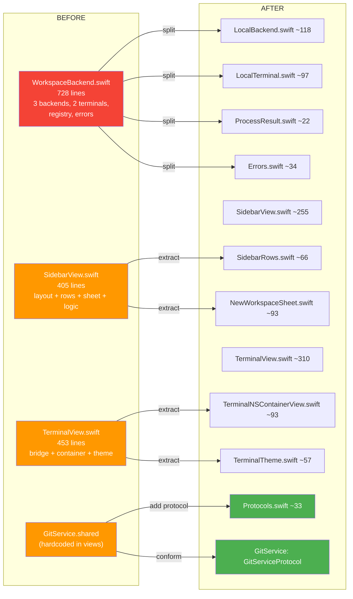
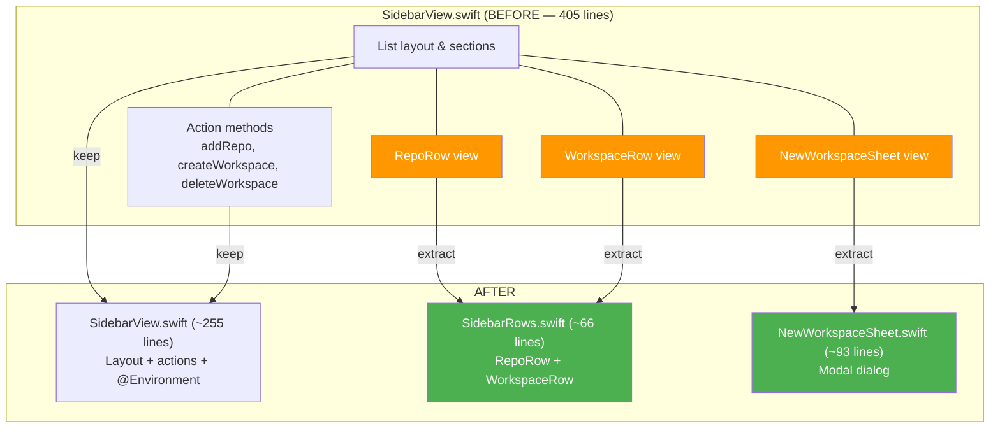
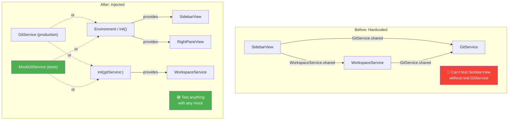

# Refactoring Log

What we changed, why we changed it, and what it teaches about Swift and macOS
development.

---

## Starting Point

The app worked. 11 source files, 4 test files, 48 passing tests. But several
files had grown large and tangled, services were hardcoded singletons, and the
test suite could only verify things by creating real git repositories on disk.

**The goal:** Make the code exemplary for learning — readable, testable, and
following patterns you'd recognize from web development.

### Before → After Overview



---

## Change 1: Extract Service Protocols

**Files:** `Protocols.swift` (new), `GitService.swift` (modified),
`WorkspaceService.swift` (modified)

### What Changed

We defined `GitServiceProtocol` and `WorkspaceServiceProtocol` — interfaces
that describe what each service can do, without committing to a specific
implementation.

```swift
public protocol GitServiceProtocol: Sendable {
    func getStatus(at path: URL) async throws -> [FileChange]
    func createBranch(_ name: String, at path: URL) async throws
    // ...
}

public actor GitService: GitServiceProtocol {
    // Existing code unchanged — just added ": GitServiceProtocol"
}
```

### Why

**The problem:** `WorkspaceService` called `GitService.shared` directly. To test
whether `createWorkspace` creates the right branch name, you had to set up a
real git repo, run real git commands, and clean up after. Slow and fragile.

**Web analogy:** Imagine a Rails service that calls `Net::HTTP.get` directly
instead of accepting an HTTP client. You can't test it without hitting a real
server. The fix is the same everywhere: depend on an interface, not a concrete
implementation.

**Why `Sendable` instead of `Actor`?** If the protocol required actor isolation,
every conforming type (including mocks) would need to be an actor. Actors add
`async` to every call, which makes mocks unnecessarily complex. Plain
`Sendable` protocols let mocks be simple `final class` types.

**TypeScript equivalent:** Extracting an interface so you can provide a mock
in tests:
```typescript
// Before: const data = await fetch('/api/repos')
// After:  const data = await this.httpClient.get('/api/repos')
```

---

## Change 2: Decompose WorkspaceBackend.swift

**Deleted:** `WorkspaceBackend.swift` (728 lines)
**Created:** `LocalBackend.swift`, `LocalTerminal.swift`, `ProcessResult.swift`,
`Errors.swift`

### What Changed

The original file contained three backend implementations (Local, Docker,
AppleContainer), two terminal classes, a registry system, and shared protocols.
Only `LocalBackend` was actually used. We deleted the speculative code and split
what remained into focused files.

| Before | After |
|--------|-------|
| 1 file, 728 lines | 4 files, ~265 lines total |
| 3 backends (2 unused) | 1 backend (the one that works) |
| `BackendRegistry` routing | Direct usage |

```
  WorkspaceBackend.swift (728 lines)
  ┌────────────────────────────────────────────────────────────────────────┐
  │  WorkspaceBackend protocol        ──► DELETED                          │
  │  BackendTerminal protocol         ──► DELETED                          │
  │  BackendRegistry                  ──► DELETED                          │
  │  ──────────────────────────────────────────────────────────────────────│
  │  LocalBackend actor               ──► LocalBackend.swift (~118 lines)  │
  │  LocalTerminal class              ──► LocalTerminal.swift (~97 lines)  │
  │  ──────────────────────────────────────────────────────────────────────│
  │  DockerBackend actor              ──► DELETED                          │
  │  DockerTerminal class             ──► DELETED                          │
  │  AppleContainerBackend actor      ──► DELETED                          │
  │  ContainerTerminal class          ──► DELETED                          │
  │  ──────────────────────────────────────────────────────────────────────│
  │  BackendError enum                ──► Errors.swift (~34 lines)         │
  │  ProcessResult struct             ──► ProcessResult.swift (~22 lines)  │
  └────────────────────────────────────────────────────────────────────────┘
       728 lines ──► 271 lines + 350 lines deleted
```

### Why

**The problem:** 350+ lines of code for Docker and Apple Container backends
that weren't connected to anything. They added complexity without value. Every
reader had to mentally skip over them to understand how the app actually worked.

**Web analogy:** This is like having a Rails service with adapters for Redis,
Memcached, and DynamoDB when you only use Redis. The adapter pattern makes
sense when you have multiple implementations. With one implementation, it's
just indirection.

**YAGNI (You Ain't Gonna Need It):** A core principle we're following. When
container support is needed, we'll add it — informed by actual requirements
rather than speculation. The code that exists then will be better than code
written today without context.

**What we kept:** `Workspace.backendIdentifier` (a string property on the
model). It's harmless, costs nothing, and keeps the door open. We deleted
*behavior* we didn't need, not *data* that might be useful.

---

## Change 3: Split SidebarView.swift

**Modified:** `SidebarView.swift` (from ~405 to ~255 lines)
**Created:** `SidebarRows.swift`, `NewWorkspaceSheet.swift`

### What Changed

Extracted two standalone view components into their own files:

- `SidebarRows.swift` — `RepoRow` and `WorkspaceRow` (pure display components)
- `NewWorkspaceSheet.swift` — the modal dialog for creating a new workspace

The action methods (`addRepo`, `createWorkspace`, `deleteWorkspace`) stayed in
`SidebarView.swift` because they access `@State` and `@Environment` properties.



### Why

**The problem:** `SidebarView.swift` mixed layout, display components, modal
sheets, and business logic. Reading it required jumping between concerns.

**React analogy:** It's like having a single `Sidebar.tsx` file that contains
the sidebar layout, row components, a modal dialog, and all the API calls.
You'd naturally extract `RepoRow.tsx`, `WorkspaceRow.tsx`, and
`NewWorkspaceDialog.tsx`.

**What stays together:** We didn't extract the action methods into a separate
"controller" or "view model" file. In SwiftUI, actions that modify `@State`
belong in the view that owns that state. Extracting them would require passing
bindings around, adding complexity for no benefit. This is different from React,
where hooks encourage extracting logic. In SwiftUI, moderate logic in views is
idiomatic.

---

## Change 4: Split TerminalView.swift

**Modified:** `TerminalView.swift` (from ~453 to ~310 lines)
**Created:** `TerminalNSContainerView.swift`, `TerminalTheme.swift`

### What Changed

Extracted two standalone AppKit components:

- `TerminalNSContainerView.swift` — an `NSView` subclass that routes mouse
  clicks to the terminal (pure AppKit, no SwiftUI awareness)
- `TerminalTheme.swift` — color definitions and an `NSColor` hex-string
  extension (pure data, no behavior)

### Why

**The problem:** The terminal file mixed three concerns: the SwiftUI-to-AppKit
bridge, low-level click routing, and color configuration. A reader trying to
understand how the terminal works had to mentally filter out theme colors. A
reader trying to change colors had to navigate past event monitors.

**Web analogy:** Like extracting a CSS theme file from a React component, and
moving a click-outside handler into its own hook. The component file keeps the
integration logic; the extracted files are reusable and independently readable.

**Why the bridge stays in one file:** `TerminalViewControllerRepresentable`,
`TerminalContainerView`, and `TerminalViewController` are tightly coupled.
The representable creates the controller, the controller manages the view. They
form one logical unit (the SwiftUI-to-AppKit bridge) and benefit from being
read together. Not everything needs to be split.

---

## Change 5: Add Environment-Based Dependency Injection

**Modified:** `WorkspaceManagerApp.swift`, `SidebarView.swift`,
`RightPaneView.swift`, `WorkspaceService.swift`

### What Changed

1. Defined `EnvironmentKey` types in `WorkspaceManagerApp.swift` so any view
   can access services via `@Environment(\.gitService)`
2. Replaced `GitService.shared` and `WorkspaceService.shared` in views with
   the environment accessor
3. Injected `GitServiceProtocol` into `WorkspaceService` via its initializer

**Before (hardcoded singleton):**
```swift
struct SidebarView: View {
    func addRepo(from url: URL) async {
        if let remote = try? await GitService.shared.getRemoteURL(at: url) { ... }
    }
}
```

**After (injected via environment):**
```swift
struct SidebarView: View {
    @Environment(\.gitService) private var gitService

    func addRepo(from url: URL) async {
        if let remote = try? await gitService.getRemoteURL(at: url) { ... }
    }
}
```

### Why

**The problem:** Views called `GitService.shared` directly. You couldn't swap
the implementation for tests, previews, or different configurations.

**How it works:** SwiftUI's Environment is a key-value store that flows down
the view tree. When a view reads `@Environment(\.gitService)`, SwiftUI walks
up the tree looking for a `.environment(\.gitService, someService)` modifier.
If it doesn't find one, it uses the `defaultValue` from the key definition —
which points to `GitService.shared`.

This means:
- **Production:** No `.environment()` modifier needed. Default = real service.
- **Tests/Previews:** Override with `.environment(\.gitService, MockGitService())`
- **Behavior is identical.** We just made the wiring explicit.

**React equivalent:** Replacing a hardcoded import with `useContext`.

**FastAPI equivalent:** Replacing `get_db()` with `Depends(get_db)`.

**Rails equivalent:** Replacing `Rails.cache` with an injectable cache store.



**Constructor injection for services:** `WorkspaceService` also accepts its
git dependency via `init`:

```swift
public init(gitService: any GitServiceProtocol = GitService.shared) {
    self.gitService = gitService
}
```

The default parameter means existing code doesn't change. Tests pass a mock:

```swift
let service = WorkspaceService(gitService: MockGitService())
```

---

## Change 6: Add Mocks and Expand Tests

**Created:** `MockGitService.swift`, `LocalBackendTests.swift`
**Expanded:** `WorkspaceServiceTests.swift`, `GitServiceTests.swift`

### What Changed

Added a mock implementation of `GitServiceProtocol` and used it to write
isolated tests for `WorkspaceService`. Also added integration tests for
git operations that weren't covered.

### The Mock Pattern

```swift
final class MockGitService: GitServiceProtocol, @unchecked Sendable {
    // Track what was called
    var createBranchCalls: [(name: String, path: URL)] = []

    // Configure what to return
    var createBranchError: Error? = nil

    func createBranch(_ name: String, at path: URL) async throws {
        createBranchCalls.append((name: name, path: path))
        if let error = createBranchError { throw error }
    }
}
```

**Jest equivalent:**
```typescript
const mockGit = {
    createBranch: jest.fn(),
}
```

The difference is that Swift mocks are hand-written classes, not generated by a
mocking library. This is intentional — hand-written mocks are explicit, easy to
read, and don't require learning a mocking framework. Since protocols change
rarely, maintaining them is minimal.

### What We Test

**With mocks (fast, isolated):**
- `createWorkspace` sends the right branch name to git
- `createWorkspace` continues gracefully when git fails
- `createWorkspace` rejects duplicate names
- `deleteWorkspace` removes or preserves files correctly
- `deleteWorkspace` cleans up empty parent directories

**With real git repos (integration):**
- `getStatus` detects untracked, modified, deleted, and staged files
- `getCurrentBranch` returns branch name or nil for detached HEAD
- `getFileTree` builds correct tree structure, respects depth limits
- `getRemoteURL` returns URL or throws when no remote exists
- `createBranch` and `checkoutBranch` actually work

**Why both?** Mock tests verify logic ("does `createWorkspace` compose the
right branch name?"). Integration tests verify reality ("does our git
status parser handle all the edge cases?"). Neither alone is sufficient.

```
  Test Strategy
  ═══════════════════════════════════════════════════

  ┌─────────────────────────────────────────────────┐
  │          Mock Tests (fast, isolated)            │
  │                                                 │
  │  WorkspaceService + MockGitService              │
  │  ├── createWorkspace sends correct branch name  │
  │  ├── createWorkspace continues when git fails   │
  │  ├── createWorkspace rejects duplicates         │
  │  ├── deleteWorkspace removes files              │
  │  └── deleteWorkspace cleans up empty parents    │
  │                                                 │
  │  Speed: ~0.01s each    Deps: none               │
  └─────────────────────────────────────────────────┘
                          ▲
                          │  Tests LOGIC
                          │  (does it compose the right arguments?)
  ─ ─ ─ ─ ─ ─ ─ ─ ─ ─ ─ ┼ ─ ─ ─ ─ ─ ─ ─ ─ ─ ─ ─
                          │  Tests REALITY
                          │  (does it parse real git output?)
                          ▼
  ┌─────────────────────────────────────────────────┐
  │      Integration Tests (real git repos)         │
  │                                                 │
  │  GitService + TestGitRepository                 │
  │  ├── getStatus detects all file states          │
  │  ├── getCurrentBranch handles detached HEAD     │
  │  ├── getFileTree respects maxDepth              │
  │  ├── getRemoteURL returns URL or throws         │
  │  └── createBranch/checkoutBranch work           │
  │                                                 │
  │  Speed: ~0.1s each    Deps: git CLI, filesystem │
  └─────────────────────────────────────────────────┘
```

**Pytest equivalent:**
```python
# Mock test — fast, tests logic
def test_create_workspace_sends_correct_branch(mock_git):
    service = WorkspaceService(git=mock_git)
    service.create_workspace(repo, "my-feature")
    assert mock_git.create_branch.call_args[0][0] == "workspace/my-feature"

# Integration test — slow, tests reality
def test_git_status_detects_untracked(tmp_path):
    run(["git", "init"], cwd=tmp_path)
    (tmp_path / "new.txt").write_text("hello")
    changes = GitService().get_status(tmp_path)
    assert changes[0].status == "untracked"
```

### Test Helpers

`TestGitRepository` is a helper that creates real git repos in temp directories.
It's like a factory or fixture:

```swift
let repo = try TestGitRepository.create()
defer { repo.cleanup() }              // Always clean up

try repo.createFile("README.md", content: "# Test")
try repo.commit(message: "Initial commit")
try repo.addRemote("origin", url: "https://github.com/test/repo.git")
```

**Rails equivalent:** A factory (FactoryBot) that creates test records. The
`defer` block is like `after(:each)` cleanup, but scoped to the function.

---

## What We Didn't Change

Knowing what *not* to change is as important as the changes themselves.

**`ContentView.swift` (115 lines):** The top-level layout is fine. It has one
job — arrange the sidebar, terminal, and right pane in a `NavigationSplitView`.
Simple enough to read in one sitting.

**`Models.swift` (187 lines):** All data types in one file. Each is short and
they reference each other. Splitting into `Repo.swift`, `Workspace.swift`,
`FileChange.swift` would just scatter related code. (In Rails terms: it's fine
to have a small `schema.rb` instead of separate files per table.)

**`RightPaneView.swift` (254 lines):** Contains the right pane plus its tab
components. They're tightly coupled and read naturally together.

**`SettingsView.swift`:** Small, standalone, no issues.

**Test structure:** We kept integration tests for `GitService` rather than
mocking git itself. Git's output format is a contract we depend on — we want
to test against the real thing.

---

## Metrics

| Metric | Before | After |
|--------|--------|-------|
| Source files | 11 | 19 |
| Test files | 4 | 6 |
| Largest source file | 728 lines | ~310 lines |
| Lines deleted | — | ~350 (speculative backends) |
| Test count | 48 | 75+ |
| Testable with mocks | 0 services | 2 services |

Every file is now readable top-to-bottom without needing to jump elsewhere.
The largest file (TerminalView at ~310 lines) has that size because its three
components form one logical unit — the SwiftUI-to-AppKit terminal bridge.
