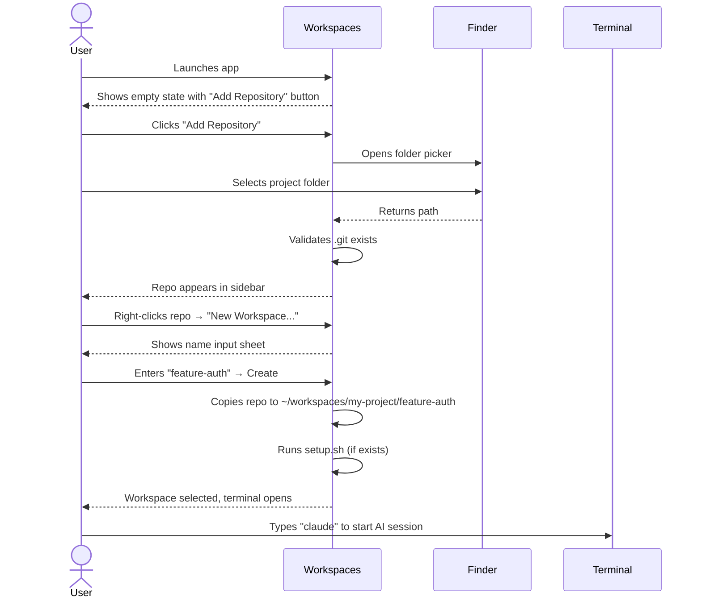
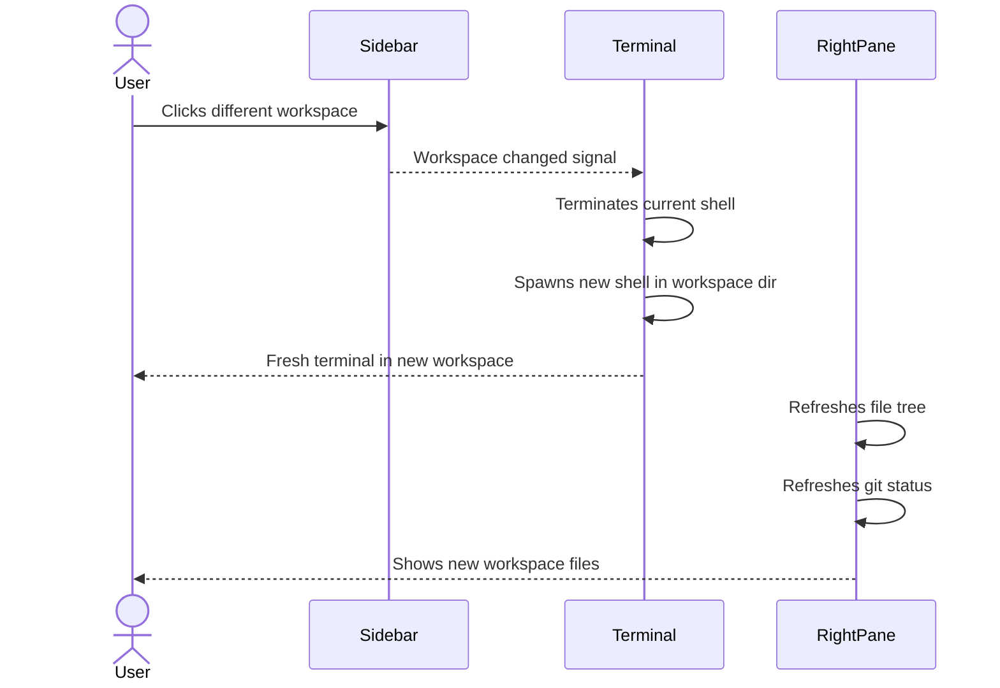
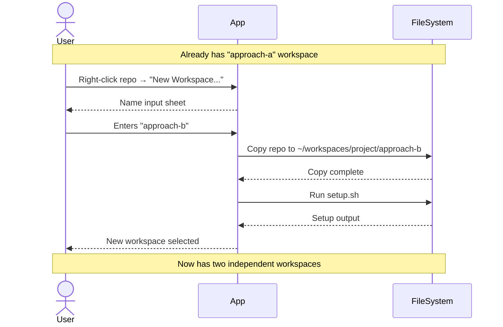
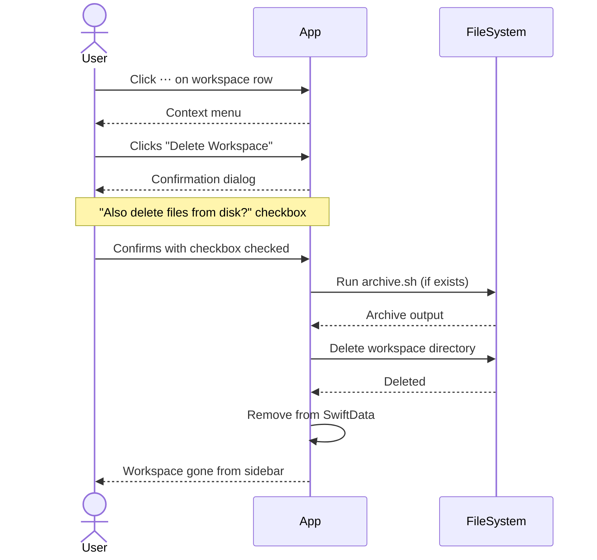
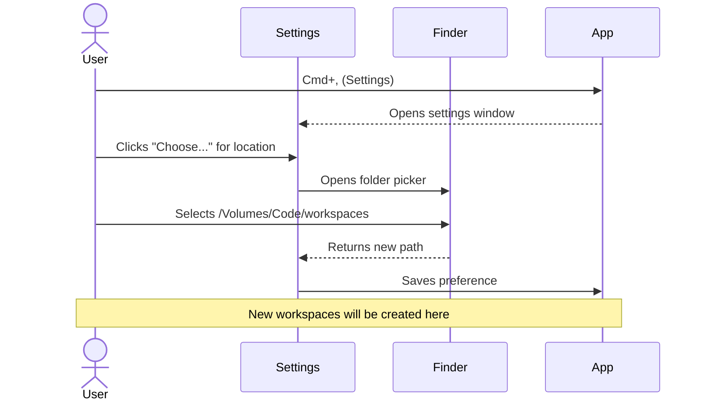

# Workspaces User Stories

## Product Context

Workspaces is a Mac app for managing isolated AI coding sessions. Users add git repos, fork them into workspaces, and run AI coding tools (Claude Code, Cursor) in an embedded terminal. Each workspace is a clean copy with automatic setup.

---

## Story 1: First-Time Setup

**As a** developer new to Workspaces
**I want to** add my first repository and create a workspace
**So that** I can start an isolated AI coding session

### Flow Diagram



### ASCII Wireframe

```
┌──────────────────────────────────────────────────────────────────────────┐
│  Workspaces                                              [−] [□] [×]     │
├────────────────┬─────────────────────────────────────────┬───────────────┤
│                │                                         │ [Files][∆ 3] │
│ M my-api    ⋯ +│  $ claude                               │───────────────│
│   ↳ feature-auth│  > Analyzing codebase...               │ 📁 src/       │
│     main · 2m  │  > Found 47 files                       │   📄 index.ts │
│                │  > What would you like to do?           │   📄 app.ts   │
│ F frontend  ⋯ +│                                         │ 📁 tests/     │
│                │  _                                      │ 📄 README.md  │
│ S services  ⋯ +│                                         │               │
│   ↳ bugfix-nav │                                         │ Updated 2s ago│
│     main · 39m │                                         │     [↻]       │
│                │                                         │               │
├────────────────┤─────────────────────────────────────────┴───────────────┤
│ [+] Add repo   │                                                         │
└────────────────┴─────────────────────────────────────────────────────────┘
```

**Sidebar structure:**
- Repos as parent rows with letter avatar, name, `⋯` menu, `+` button
- Workspaces nested under their repo with branch icon (↳)
- Workspace shows: name, branch, time since last activity
- Selected workspace highlighted
- "Add repository" at bottom

### Steps

1. **Launch app** — User sees empty state encouraging them to add a repository
2. **Add repository** — Folder picker opens, user selects a git project
3. **Repo validated** — App confirms .git exists, extracts repo name
4. **Create workspace** — Context menu offers "New Workspace...", user names it
5. **Workspace initialized** — Repo copied, setup.sh runs, terminal opens in workspace

---

## Story 2: Switching Between Workspaces

**As a** developer with multiple active workspaces
**I want to** quickly switch between them
**So that** I can context-switch without losing my place

### Flow Diagram



### ASCII Wireframe

```
┌──────────────────┐         ┌──────────────────┐
│ M my-api      ⋯ +│         │ M my-api      ⋯ +│
│   ↳ feature-auth │ ──────▶ │   ↳ feature-auth │
│     main · 2m ◀──│  click  │     main · 2m    │
│   ↳ bugfix-nav   │         │   ↳ bugfix-nav ◀─│
│     main · 39m   │         │     main · now   │
└──────────────────┘         └──────────────────┘
        │                            │
        ▼                            ▼
┌─────────────────┐          ┌─────────────────┐
│ ~/ws/auth/ $    │          │ ~/ws/bugfix/ $  │
│ claude          │          │ _               │
│ > Working on... │          │                 │
└─────────────────┘          └─────────────────┘
```

### Steps

1. **View workspaces** — Sidebar shows all workspaces, current one highlighted
2. **Click different workspace** — User clicks another workspace name
3. **Terminal switches** — Old terminal terminates, new one spawns in new directory
4. **Right pane updates** — File tree and git status refresh for new workspace

---

## Story 3: Creating Parallel Experiments

**As a** developer exploring different solutions
**I want to** create multiple workspaces from the same repo
**So that** I can experiment without affecting other work

### Flow Diagram



### ASCII Wireframe

```
┌──────────────────┐
│ M my-api      ⋯ +│ ◄── Click + to add workspace
│   ↳ approach-a   │
│     main · 1h    │     ┌───────────────────┐
│   ↳ approach-b ◀─│     │ New Workspace...  │
│     main · now   │     │ Reveal in Finder  │
│                  │     │ Remove Repo       │
│ F frontend    ⋯ +│     └───────────────────┘
│                  │     (⋯ menu shown)
└──────────────────┘

~/workspaces/my-api/
├── approach-a/     ← Independent copy
│   ├── .git/
│   └── src/
└── approach-b/     ← Independent copy
    ├── .git/
    └── src/
```

### Steps

1. **Right-click repo** — Context menu appears with "New Workspace..." option
2. **Name workspace** — User enters descriptive name like "approach-b"
3. **Copy created** — Full repo copy made to workspaces directory
4. **Setup runs** — If setup.sh exists, it runs automatically
5. **Workspace ready** — New workspace selected, terminal opens there

---

## Story 4: Cleaning Up Completed Work

**As a** developer who finished a task
**I want to** archive or delete a workspace
**So that** I can keep my workspace list clean

### Flow Diagram



### ASCII Wireframe

```
┌────────────────────────────────────────┐
│       Delete "feature-auth"?           │
├────────────────────────────────────────┤
│                                        │
│  This will remove the workspace from   │
│  the list.                             │
│                                        │
│  ☑ Also delete files from disk         │
│                                        │
│          [Cancel]    [Delete]          │
└────────────────────────────────────────┘
```

### Steps

1. **Right-click workspace** — Context menu shows Archive and Delete options
2. **Click Delete** — Confirmation dialog appears
3. **Choose file handling** — Checkbox controls whether files are deleted from disk
4. **archive.sh runs** — If present, cleanup script runs first
5. **Workspace removed** — Deleted from list (and optionally from disk)

---

## Story 5: Configuring Workspace Location

**As a** developer with specific disk organization preferences
**I want to** choose where workspaces are stored
**So that** they're on my preferred drive or folder

### Flow Diagram



### ASCII Wireframe

```
┌─────────────────────────────────────────────────────┐
│  Settings                                    [×]    │
├─────────────────────────────────────────────────────┤
│                                                     │
│  Workspaces Location                                │
│  ┌───────────────────────────────────────┐          │
│  │ /Volumes/Code/workspaces          [📁]│          │
│  └───────────────────────────────────────┘          │
│  Where new workspaces are created.                  │
│                                                     │
│  [Reset to Default]                                 │
│                                                     │
│  ─────────────────────────────────────────────────  │
│                                                     │
│  Terminal                                           │
│  Font Size: [13]                                    │
│                                                     │
└─────────────────────────────────────────────────────┘
```

### Steps

1. **Open settings** — User presses Cmd+, or uses menu
2. **View current location** — Shows current workspaces root path
3. **Click Choose** — Folder picker opens
4. **Select new location** — User picks preferred directory
5. **Setting saved** — All new workspaces will be created in new location
