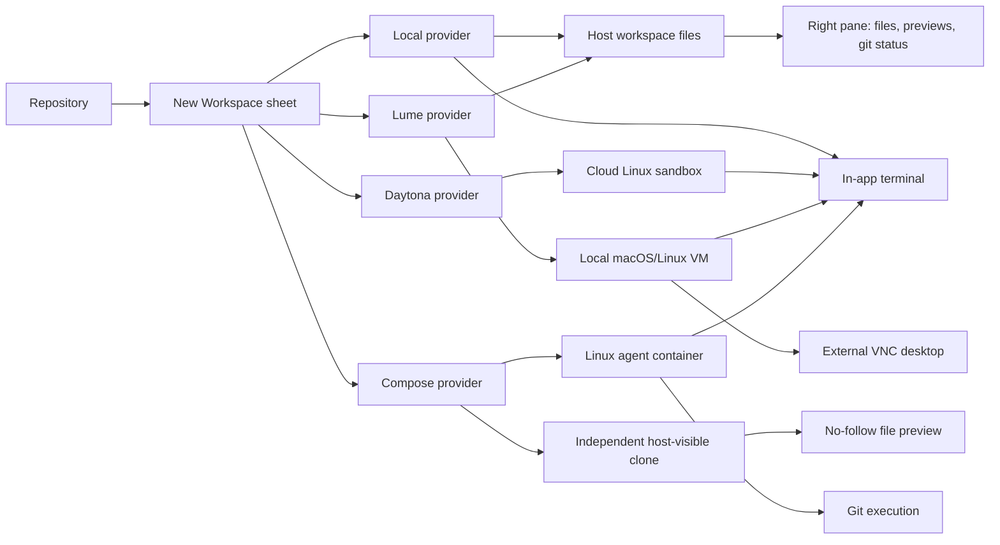
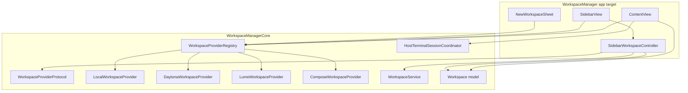
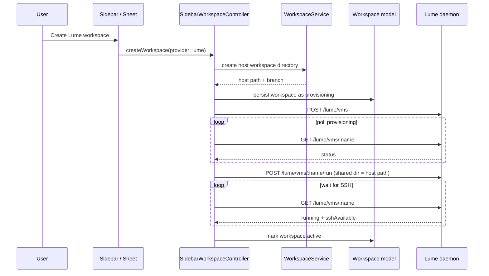
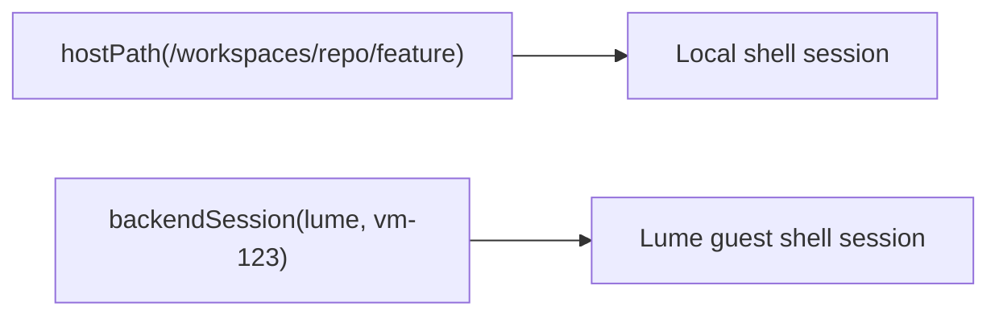

# Workspace providers: local, cloud, VM, and Compose

This document explains the workspace provider model, including local shells,
cloud sandboxes, Lume VMs, and Docker Compose containers. Historical context and
design rationale appear at the end.

## Quick Definitions

- `Daytona` is the cloud provider in this app. It creates remote Linux sandboxes and gives the app an SSH entrypoint. For more Daytona-specific detail, see [Daytona Cloud Workspaces](daytona-vm.md).
- `Lume` is a local Apple Silicon VM system with a daemon and CLI. In this app it creates local Linux or macOS VMs, mounts a host workspace directory into the guest, provides terminal access through `lume ssh`, can expose a full desktop through VNC, and relies on a standalone validated-base gate before macOS clone reuse.
- `Docker Compose` runs one local Linux Compose project per workspace, with an independent host-visible clone and an `agent` service for terminals and Git. See [Docker Compose workspaces](development/compose-workspaces.md) for its lifecycle and trust boundaries.

## Current Mental Model

The app now thinks in terms of:

1. a repository
2. a workspace record owned by the app
3. a workspace provider that supplies compute and launch details

```text
Repository
    |
    v
New Workspace
    |
    +-------------------+--------------------+----------------------+
    |                   |                    |                      |
    v                   v                    v                      v
  Local             Daytona               Lume VM              Docker Compose
  host shell        cloud sandbox         local VM             Linux containers
  host files        SSH terminal          host-shared files    independent clone
                                          SSH + desktop        exec + guest tmux
```

The important boundary is:

- the app owns the workspace list, selection state, file and changes presentation, and terminal session routing
- the provider owns creation, start, stop, delete, and environment-specific launch behavior

For Compose, host-visible files do not authorize host execution: Git operations
run inside the agent container, and native file inspection rejects symbolic links.



## Provider Capabilities

| Provider | Compute location | Files seen by right pane | Terminal launch | Desktop launch | Archive support |
| --- | --- | --- | --- | --- | --- |
| Local | Host macOS process | Host workspace directory | Default shell in workspace directory | No | Local-only archive toggle |
| Daytona | Cloud Linux sandbox | Placeholder path only | Provider returns SSH command | No | Yes |
| Lume | Local VM on Apple Silicon | Host workspace directory mounted into guest | `lume ssh <vm>` | External VNC URL | No |
| Docker Compose | Local Docker Linux runtime | Independent host clone; read-only native previews; Git in container | `docker compose exec` with guest tmux | No | No |

## What The User Sees

### Creating a workspace

The new workspace sheet presents a provider picker instead of a local/remote toggle.

- `Local` behaves like the original host workspace flow.
- `Cloud Linux` is available when the repo has a remote origin URL and the Daytona backend is configured.
- `macOS VM` and `Linux VM` are available on supported Apple Silicon hosts. Missing Lume install or daemon health is handled by the first-use setup and repair flow instead of hiding the option.
- `Docker Compose` requires a running local Docker context with Linux containers and the Compose plugin. It builds the app's trusted template and runs setup in the agent container.

When `Lume VM` is selected, the sheet also offers a guest OS choice:

- `Linux`
- `macOS`

The Lume copy in the sheet is intentionally simple:

- files stay on the host
- the terminal runs inside the VM
- the desktop opens in an external VNC client
- Workspaces can install or repair Lume automatically on first use
- macOS VM creation prefers cloning a validated local base VM

### Opening a workspace

Clicking a workspace still feels like selecting a normal row in the sidebar, but the launch path is provider-specific:

- `Local`: activate a host shell in the workspace directory.
- `Daytona`: get or start the sandbox, then launch the returned SSH command.
- `Lume`: ensure the VM is running and SSH-ready, then launch `lume ssh`.
- `Docker Compose`: validate the saved template and running project, then attach to its agent service. A stopped project must be started explicitly.

### Opening the desktop

Only providers that support desktop access expose `Open Desktop`.

Today that means Lume only. The action appears in:

- the workspace context menu
- the selected-workspace toolbar

The app asks the provider for a `DesktopLaunchSpec`, then opens the returned `vncUrl` with `NSWorkspace`.

## High-Level Architecture

The provider layer lives in `WorkspaceManagerCore`, and the UI talks to it through environment injection and the sidebar controller.



## The Lume Workspace Flow

Lume is modeled as a **host-shared workspace**.

The host workspace directory is created first, exactly like a local workspace. Then the VM is created and that same directory is mounted into the guest. The app keeps using the host path for:

- file tree inspection
- code preview
- git status
- Finder reveal
- path copy

The guest supplies execution and desktop.

### Validated macOS base

macOS is not prepared from scratch for every workspace. Workspaces keeps one validated base VM per host profile and uses that as the clone source for normal macOS workspace creation.

The base becomes reusable only after the standalone Lume validator proves:

- the base boots
- the base gets an IP
- `lume ssh` succeeds
- a disposable clone also boots and reaches SSH

For the detailed contract and storage layout, see [development/lume-integration.md](development/lume-integration.md).



## Terminal And Desktop Launch Specs

The UI no longer hard-codes "if local then directory, if remote then SSH".

Providers return launch specs instead.

### `TerminalLaunchSpec`

Contains:

- the canonical terminal session key
- the working directory the terminal should use
- an optional custom command
- the workspace status to persist after launch

Examples:

- `Local`: host path, no custom command
- `Daytona`: backend session key, temp working directory, SSH command
- `Lume`: backend session key, host workspace path, `lume ssh <vm>`
- `Docker Compose`: backend session key, trusted configuration directory, and a Compose exec command. At launch the app binds a stable terminal UUID to the guest tmux session name.

### `DesktopLaunchSpec`

Contains:

- the VNC URL to open
- the workspace status to persist after launch

Only Lume currently returns one.

## Session Identity

Provider-backed terminal sessions now use:

```swift
HostTerminalSessionKey.backendSession(providerID: String, instanceID: String)
```

Lume and Compose terminals can have host-visible files without being host shell
sessions. Their provider keys keep terminal routing separate from local sessions
that happen to use the same directory.



## Selection Syncing

When a terminal session becomes active, the app maps it back to a workspace using:

- `backendIdentifier`
- `terminalSessionIdentifier`

where `terminalSessionIdentifier` is backed by persisted `sessionRoutingID` for current records and only falls back to `remoteId` for legacy rows.

`remoteId` remains the provider lifecycle/status identity, not the universal terminal routing key.

That is what keeps sidebar selection synchronized with provider-backed terminals after adding Lume.

## Workspace Status Model

`WorkspaceStatus` now includes:

- `provisioning`
- `active`
- `stopped`
- `archived`

`provisioning` covers creation and guest setup for Lume and Compose. A Compose
workspace becomes active only after its readiness probe and setup script succeed.

### Provider status mapping

| Provider state | App status |
| --- | --- |
| Lume `running` | `active` |
| Lume `stopped` | `stopped` |
| Lume `provisioning` / `provisioning (stale)` | `provisioning` |
| Missing external Lume VM | `archived` |
| Daytona `started` / `starting` | `active` |
| Daytona `stopped` / `stopping` | `stopped` |
| Daytona `archived` / `archiving` | `archived` |
| Compose agent running and healthy | `active` |
| Compose project stopped or missing | `stopped` |
| Compose daemon unavailable | Error; preserve last observed state |

For Lume, `archived` is only a compatibility status in the shared workspace model when the external VM no longer exists. The UI does not offer an Archive action for Lume.

## Backend Metadata

The workspace model stores provider-specific metadata as JSON in `backendMetadataRaw`.

For Lume that payload includes:

- `vmName`
- `guestOS`
- `sharedHostPath`
- `desktopSupported`

That lets the app recover provider-specific behavior from the persisted workspace record without adding Lume-only top-level fields.

Compose stores `ComposeSandboxMetadata`, including its project name, Docker
context and endpoint, checkout and trusted configuration paths, terminal service,
guest working directory, and template hashes. Its receipt and template snapshot
are host-owned and outside the agent's writable clone.

## Status Sync On Launch

At app startup, `ContentView` groups non-local workspaces by provider and asks each provider to reconcile status.

This preserves provider-specific behavior:

- Daytona lists sandboxes and maps cloud states
- Lume lists VMs from the daemon and maps VM states
- Compose validates the saved project and reads its agent service state; daemon errors do not imply deletion

The UI does not have to know how those providers obtain or interpret status.

## File Map

| File | Purpose |
| --- | --- |
| `Sources/WorkspaceManagerCore/Services/WorkspaceProviders.swift` | Provider protocol, registry, launch specs, shared types |
| `Sources/WorkspaceManagerCore/Services/LocalWorkspaceProvider.swift` | Host-backed workspace provider |
| `Sources/WorkspaceManagerCore/Services/DaytonaWorkspaceProvider.swift` | Daytona provider wrapper |
| `Sources/WorkspaceManagerCore/Services/LumeWorkspaceProvider.swift` | Lume REST + CLI provider |
| `Sources/WorkspaceManagerCore/Services/ComposeWorkspaceProvider.swift` | Independent clone, container lifecycle, Git execution, and terminal attachment |
| `Sources/WorkspaceManagerCore/Services/ComposeWorkspaceRuntime.swift` | Trusted template snapshots, context validation, and Docker command construction |
| `Sources/WorkspaceManager/Services/ComposeRepositoryInspection.swift` | Routes native Changes and diff actions to container Git |
| `Sources/WorkspaceManager/Services/ComposeSafeFiles.swift` | Bounded no-follow file inspection and read-only preview |
| `Sources/WorkspaceManagerCore/Models/Models.swift` | `WorkspaceStatus.provisioning`, `backendMetadataRaw` |
| `Sources/WorkspaceManagerCore/Services/HostTerminalSessionCoordinator.swift` | `backendSession` identity semantics |
| `Sources/WorkspaceManager/Views/MainWindow/NewWorkspaceSheet.swift` | Provider picker and Lume guest OS selection |
| `Sources/WorkspaceManager/Views/MainWindow/SidebarView.swift` | Provider actions, creation progress, desktop action |
| `Sources/WorkspaceManager/Views/MainWindow/ContentView.swift` | Generic terminal launch, desktop launch, status sync |
| `Sources/WorkspaceManager/Views/MainWindow/MainSelectionCoordinator.swift` | Selection sync from backend sessions |

## Practical Constraints In V1

- Lume support assumes Apple Silicon.
- The app expects the official Lume daemon on `localhost:7777`.
- Full desktop support is external VNC only.
- The terminal lands in the guest shell's default working directory; the app still treats the host workspace path as the source of truth for files.
- Daytona remains Linux-only and remote-origin-dependent.
- Compose is local and Linux-only. Native previews are read-only; project Compose files are not imported. Optional Postgres remains a standalone reference feature.

---

## Historical Context And Design Rationale

Everything above is the current behavior. This section is about how the architecture evolved and why specific decisions were made.

### How we got here

The original non-local path was effectively Daytona-specific. The app had a local flow and a Daytona flow, with only a thin abstraction over Daytona.

That was enough for SSH-only cloud sandboxes, but Lume changed the shape of the problem:

- it supports Linux and macOS guests
- it can expose a full desktop, not only a shell
- it runs through a local daemon plus CLI instead of a cloud-only API
- it benefits from host-shared files, which keeps the right pane and git tooling simple

That is why the code moved from a generic "remote backend" idea to a true **workspace provider** model.

### Why Lume lifecycle uses REST

Creation, status sync, start, stop, delete, and desktop lookup go through the daemon on `http://localhost:7777/lume`.

That keeps VM ownership outside the app process and matches Lume's natural deployment model:

- the daemon survives app restarts
- the daemon is the upstream control plane
- the app can reconcile drift without becoming the VM supervisor

### Why Lume terminal access uses `lume ssh`

For the in-app terminal, the app launches:

```bash
lume ssh <vm-name>
```

This keeps terminal attachment aligned with the upstream CLI and fits cleanly into Ghostty's existing custom-command launch path.

### Why not `pylume`

`pylume` was intentionally not used because it does not improve the app's control model once the daemon and CLI already exist. It would add another dependency layer without simplifying lifecycle control or terminal attachment.

### Why not embed a Lume library directly

Embedding VM control in-process would couple VM ownership to the app process, which would make lifecycle handling more fragile and would work against the goal of durable, externally reconcilable state.

## Related Docs

- [Daytona Cloud Workspaces](daytona-vm.md)
- [Docker Compose workspaces](development/compose-workspaces.md)
- [Standalone Compose agent sandbox](../examples/compose-agent-sandbox/README.md)
- [Lume Validation Runbook](development/lume-validation.md)
- [Swift & macOS Patterns for Web Developers](archive/patterns.md)
- [Product Overview](product_overview.md)
